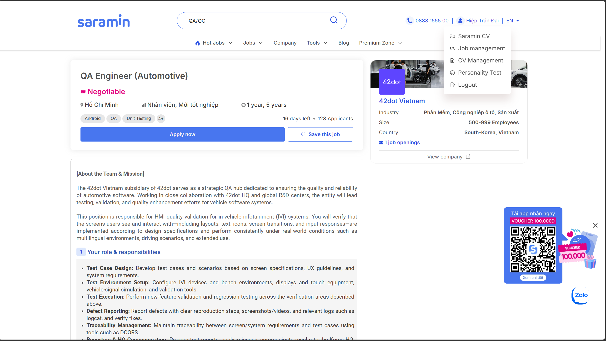

# HW01 – Việc làm QA/QC · 20 Lỗi Phần Mềm · Kiểm Thử Thiết Bị Vật Lý
## Báo Cáo Bài Tập

**Họ và tên sinh viên:** Trần Đại Hiệp  
**Mã số sinh viên (MSSV):** 23120256  
**Môn học:** Kiểm thử phần mềm (Software Testing)  
**Ngày nộp:** 28/09/2026  
**Công cụ AI sử dụng:** Gemini, ChatGPT  

---

## Khung Tiêu Đề / Trang Bìa

* **Sinh viên thực hiện:** Trần Đại Hiệp - 23120256 - Kiểm thử phần mềm.
* **Ngày nộp bài:** 28/09/2026.
* **Điểm tự đánh giá:** (Ví dụ: 095).
* **Công cụ AI sử dụng:** Gemini, ChatGPT (phiên bản cập nhật).
* **Cam kết:** Tôi xác nhận Biểu mẫu Khai báo AI ([AI]03) đã được đính kèm ở phần cuối của báo cáo này.

---

## Mục Lục

1. [Yêu Cầu 1 – Thị Trường Việc Làm QA/QC 2026+](#yêu-cầu-1--thị-trường-việc-làm-qaqc-2026-40-điểm)
2. [Yêu Cầu 2 – 20 Lỗi Phần Mềm Giai Đoạn 2022–2026](#yêu-cầu-2--20-lỗi-phần-mềm-20222026-20-điểm)
3. [Yêu Cầu 3 – Thiết Kế Test Case Cho MỘT Thiết Bị Vật Lý](#yêu-cầu-3--thiết-kế-test-case-cho-một-thiết-bị-vật-lý-40-điểm)
4. [Phần Hợp Tác Với AI (AI Collaboration Section)](#phần-hợp-tác-với-ai-bắt-buộc--theo-rubric)
5. [Tự Đánh Giá (Self-Assessment)](#tự-đánh-giá-self-assessment)
6. [Tài Liệu Tham Khảo (References)](#tài-liệu-tham-khảo-references)
7. [Phụ Lục (Appendices)](#phụ-lục-appendices)

---

## Yêu Cầu 1 – Thị Trường Việc Làm QA/QC 2026+ *(40 điểm)*

> **Mục tiêu:** Thu thập và phân tích 10 tin tuyển dụng QA/QC gần đây (được đăng trong vòng 60 ngày tính đến ngày nộp bài), trong đó có $\ge 3$ vị trí yêu cầu kỹ năng AI/LLM/Automation-AI.

### 1.0 Tổng Quan / Giới Thiệu Về Thị Trường Việc Làm 2026+

Thị trường việc làm QA/QC năm 2026 đang chuyển dịch mạnh mẽ từ kiểm thử thủ công (manual testing) truyền thống sang **quality engineering, automation testing, kiểm thử API, quy trình CI/CD và AI-assisted testing**. Tại Việt Nam, dữ liệu thị trường tuyển dụng hiện tại cho thấy nhu cầu rất lớn đối với các kỹ năng như Jira, SQL, Selenium, kiểm thử API, test planning và CI/CD. Đồng thời, các vị trí QA tăng cường năng lực bởi AI (AI-augmented QA) đang bắt đầu xuất hiện, trong đó các công cụ như GPT/Claude/Copilot được ứng dụng để tạo test case, sinh dữ liệu kiểm thử (test data), phân tích log lỗi và hỗ trợ viết mã tự động hóa.

Dựa trên **10 tin tuyển dụng được thu thập**, các kỹ năng phổ biến nhất gồm: **kiểm thử thủ công, thiết kế test case, kiểm thử tự động, kiểm thử API, báo cáo lỗi (bug reporting), quy trình Agile/Scrum, SQL và CI/CD**. AI xuất hiện trong một số vai trò dưới dạng đối tượng cần kiểm thử (testing target) hoặc công cụ nâng cao năng suất (productivity tool), chứng minh rằng AI đang trở thành một kỹ năng bổ trợ cho QA thay vì thay thế hoàn toàn vai trò kiểm thử truyền thống. Do đó, **sơ đồ tư duy (mindmap) về vai trò QA/QC trong Phụ lục E** cần được cập nhật để phản ánh sự dịch chuyển này. Ba sai sót được phát hiện trong sơ đồ tư duy do AI tạo ra là: **(1) tách biệt kiểm thử thủ công với tự động hóa/AI thay vì xem chúng là quy trình tích hợp, (2) bỏ sót kiểm thử có AI hỗ trợ và kiểm thử các hệ thống AI với tư cách là trách nhiệm mới của QA, và (3) chưa thể hiện đầy đủ các kỹ năng kỹ thuật hiện đại như kiểm thử API, CI/CD và kiểm thử trên nền tảng đám mây (cloud-based testing).**

---

### Bảng Tổng Hợp Tin Tuyển Dụng

| STT | Vị Trí Tuyển Dụng | Công Ty | Nền Tảng | Ngày Đăng | Yêu Cầu AI? | Mức Lương |
|---:|---|---|---|---|:---:|---|
| 1 | AI Quality Assurance Tester (Data Testing) | SCC Vietnam | LinkedIn | 02/09/2026 | **Có** | Thỏa thuận |
| 2 | Senior QA Engineer (AI-Augmented Quality Engineering) | Ins Enco | LinkedIn | 16/09/2026 | **Có** | 30–40 triệu VND/tháng |
| 3 | Junior QA Engineer | DXC Technology | LinkedIn | 09/09/2026 | Không | Thỏa thuận |
| 4 | QA/QC Tester (Automation) | VIB | Indeed | 10/08/2026 | **Có** | Thỏa thuận |
| 5 | Automation Tester (Tier2.NT) | FPT Software | Indeed | 11/08/2026 | Không | Thỏa thuận |
| 6 | QA Engineer (Automotive) | 42dot Vietnam | Saramin | 07/08/2026 | Không | Thỏa thuận |
| 7 | Game QA Tester | SUNTEK | Saramin | 01/09/2026 | Không | Thỏa thuận |
| 8 | Senior QC Engineer (API & QA Process) | CyberLogitec Vietnam | Saramin | 04/09/2026 | Không | Thỏa thuận |
| 9 | Manual QA Tester | HIPPO Technology | TopCV | 11/08/2026 | Không | 10–15 triệu VND/tháng |
| 10 | Game Tester | BMH Technology | TopCV | 11/08/2026 | Không | Thỏa thuận |

---

### 1.1 Tin Tuyển Dụng #1 – AI Quality Assurance Tester (Data Testing) tại SCC Vietnam

- **Nền tảng & Đường dẫn:** LinkedIn – https://www.linkedin.com/jobs/view/4459648611/
- **Ảnh chụp màn hình có ngày tháng:** 
- **Mô tả công việc:** Kiểm thử trợ lý bán hàng ứng dụng AI (AI-powered sales agent), bao gồm kiểm thử hội thoại AI, đường ống dữ liệu (data pipelines), thông tin chuyên sâu về tài khoản (account insights), tài liệu chuẩn bị cuộc họp và các tích hợp hệ thống.
- **Kỹ năng yêu cầu:**
  - Kiểm thử thủ công & kiểm thử tự động
  - Kiểm thử SIT/FAT & kiểm thử chức năng (functional testing)
  - Kiểm thử giao diện AI / giao diện hội thoại (conversational interface)
  - Đường ống dữ liệu & tích hợp hệ thống
  - Nền tảng Azure AI / Điện toán đám mây & CRM
  - Quy trình Agile & vòng đời kiểm thử (STLC)
  - Kỹ năng giao tiếp & làm việc nhóm
- **Mức lương:** Thỏa thuận / Cạnh tranh
- **Yêu cầu AI/LLM?** **Có** — Có kinh nghiệm kiểm thử các "ứng dụng tích hợp AI" và giao diện hội thoại thông minh.
- **Phân tích tác động của AI:** AI có thể hỗ trợ tạo test case, sinh dữ liệu kiểm thử và phân tích kết quả. Tuy nhiên, tester con người vẫn đóng vai trò quyết định trong việc kiểm chứng nghiệp vụ, bảo đảm tính tuân thủ pháp lý và đánh giá chất lượng phản hồi của AI.

---

### 1.2 Tin Tuyển Dụng #2 – Senior QA Engineer (AI-Augmented Quality Engineering) tại Ins Enco

- **Nền tảng & Đường dẫn:** LinkedIn – https://www.linkedin.com/jobs/view/senior-qa-engineer-ai-augmented-quality-engineering-4466589603/
- **Ảnh chụp màn hình có ngày tháng:** 
- **Mô tả công việc:** Thiết kế chiến lược QA, tự động hóa kiểm thử E2E/API, tích hợp kiểm thử vào pipeline CI/CD, thực hiện kiểm thử khám phá (exploratory testing) và ứng dụng các công cụ AI để nâng cao hiệu suất kiểm thử.
- **Kỹ năng yêu cầu:**
  - Playwright, Postman / Bruno
  - Kiểm thử API, SQL & kiểm thử cơ sở dữ liệu
  - Git & quy trình CI/CD
  - Jira + Xray / Zephyr
  - Phương pháp luận Agile
  - GPT / Claude & các công cụ kiểm thử AI
  - Mabl / Testim, Applitools / Percy
- **Mức lương:** 30.000.000 – 40.000.000 VND gross/tháng
- **Yêu cầu AI/LLM?** **Có** — "Có kinh nghiệm thực tế sử dụng GPT / Claude trong việc tạo và phân tích kiểm thử."
- **Phân tích tác động của AI:** AI có khả năng tự động tạo test case, sinh dữ liệu thử nghiệm, viết kịch bản API test và phân tích nhật ký lỗi (failure logs). Kỹ sư QA con người chịu trách nhiệm chính về chiến lược kiểm thử tổng thể, đánh giá rủi ro và đưa ra quyết định chất lượng phát hành.

---

### 1.3 Tin Tuyển Dụng #3 – Junior QA Engineer tại DXC Technology

- **Nền tảng & Đường dẫn:** LinkedIn – https://www.linkedin.com/jobs/view/4463240019/
- **Ảnh chụp màn hình có ngày tháng:** 
- **Mô tả công việc:** Thực hiện kiểm thử thủ công và tự động cho các ứng dụng Web/Mobile, quản lý vòng đời lỗi, xây dựng test case và hỗ trợ quy trình tự động hóa QA.
- **Kỹ năng yêu cầu:**
  - Kiểm thử thủ công: Functional, Regression, Smoke, UAT
  - Katalon Studio và/hoặc TestComplete
  - Kiểm thử API với Postman / Katalon
  - Kiến thức SQL cơ bản
  - Jira, mô hình Agile / Scrum
  - Quy trình SDLC / STLC
  - Giao tiếp & làm việc nhóm hiệu quả
  - Git / Jenkins / Azure DevOps (lợi thế)
- **Mức lương:** Thỏa thuận / Cạnh tranh
- **Yêu cầu AI/LLM?** Không — Không có yêu cầu cụ thể về AI/LLM.
- **Phân tích tác động của AI:** AI có thể hỗ trợ soạn thảo test case, viết khung kịch bản test script và phân tích mô tả lỗi. Kiểm thử thủ công thực tế, thấu hiểu yêu cầu người dùng và phối hợp chặt chẽ với đội ngũ lập trình vẫn đòi hỏi sự can thiệp của con người.

---

### 1.4 Tin Tuyển Dụng #4 – QA/QC Tester (Automation) tại VIB (Ngân hàng Quốc Tế)

- **Nền tảng & Đường dẫn:** Indeed – https://vn.indeed.com/viewjob?jk=1aab3d18138da8b5
- **Ảnh chụp màn hình có ngày tháng:** 
- **Mô tả công việc:** Xây dựng và duy trì kiểm thử tự động cho hệ thống ứng dụng Web, Mobile, API và ngân hàng lõi; tích hợp bộ test vào CI/CD và đảm bảo chất lượng các bản phát hành.
- **Kỹ năng yêu cầu:**
  - Selenium, Appium, TestNG / JUnit, Postman / Newman, JMeter, Katalon
  - Kiểm thử Web, Mobile & REST API
  - CI/CD, Jenkins, GitLab CI, Azure DevOps
  - Thành thạo một trong các ngôn ngữ: Java, Python, JavaScript hoặc Groovy
  - Thiết kế test case & quản lý lỗi
  - Tư duy logic, giao tiếp & làm việc nhóm
- **Mức lương:** Thỏa thuận theo năng lực
- **Yêu cầu AI/LLM?** **Có** — Thành thạo ít nhất một **công cụ AI hỗ trợ phát triển (AI Dev Tool / Dev Copilot)**.
- **Phân tích tác động của AI:** AI hỗ trợ sinh mã script kiểm thử tự động, phân tích dữ liệu kiểm thử và tăng tốc viết test suite. Kỹ sư QA con người vẫn đảm nhận lập kế hoạch kiểm thử, phân tích rủi ro nghiệp vụ ngân hàng và ra quyết định nghiệm thu.

---

### 1.5 Tin Tuyển Dụng #5 – Automation Tester (Tier2.NT) tại FPT Software

- **Nền tảng & Đường dẫn:** Indeed – https://vn.indeed.com/viewjob?jk=7fa09a67fe17d0aa
- **Ảnh chụp màn hình có ngày tháng:** 
- **Mô tả công việc:** Phát triển và bảo trì hệ thống kiểm thử tự động cho các ứng dụng web, thực hiện kiểm thử hồi quy/tích hợp, phân tích báo cáo lỗi và vận hành kiểm thử trên pipeline CI/CD.
- **Kỹ năng yêu cầu:**
  - Trên 3 năm kinh nghiệm kiểm thử phần mềm; trên 2 năm kinh nghiệm Automation Test
  - Thành thạo Selenium và/hoặc Tricentis Tosca
  - Kiểm thử API bằng Postman
  - Jira, TestRail / Zephyr, Confluence
  - Ngôn ngữ lập trình: Java hoặc JavaScript
  - Nắm vững STLC, SDLC, mô hình Agile/Scrum
  - Kỹ năng giao tiếp tiếng Anh tốt
  - Hiểu biết về CI/CD
- **Mức lương:** Thỏa thuận
- **Yêu cầu AI/LLM?** Không — Không nêu yêu cầu bắt buộc về AI/LLM.
- **Phân tích tác động của AI:** AI có thể hỗ trợ tạo khung kịch bản tự động hóa và phân tích kết quả test run. Tester con người vẫn giữ vai trò chính trong việc thiết kế kiến trúc framework kiểm thử, thẩm định lỗi phức tạp và phối hợp liên phòng ban.

---

### 1.6 Tin Tuyển Dụng #6 – QA Engineer (Automotive) tại 42dot Vietnam

- **Nền tảng & Đường dẫn:** Saramin – https://saramin.vn/detail-jobs/qa-engineer-automotive-42dot-vietnam-2131159
- **Ảnh chụp màn hình có ngày tháng:** 
- **Mô tả công việc:** Thẩm định hệ thống HMI/IVI (thông tin giải trí) trên ô tô thông minh, thiết kế test case, thực hiện kiểm thử hồi quy, báo cáo lỗi giao diện và tự động hóa kiểm thử UI trên xe.
- **Kỹ năng yêu cầu:**
  - Kiểm thử giao diện nhúng Android / Embedded GUI
  - Thiết kế test case & kiểm thử hồi quy
  - ADB, Appium, UI Automator
  - So sánh ảnh chụp màn hình (Screenshot comparison) & nhận dạng ký tự quang học (OCR)
  - Tự động hóa CI/CD
  - Hệ thống quản lý yêu cầu IBM DOORS
  - Phân tích Logcat & quy trình báo cáo lỗi
  - Tiếng Anh cơ bản, tỉ mỉ và cẩn thận
- **Mức lương:** Thỏa thuận
- **Yêu cầu AI/LLM?** Không — Không có yêu cầu cụ thể về AI/LLM.
- **Phân tích tác động của AI:** AI có thể hỗ trợ phân tích hình ảnh bằng OCR, sinh test case biên và phân tích nhật ký lỗi thiết bị nhúng. Tester con người là không thể thay thế trong việc kiểm chứng hành vi xe trong điều kiện vận hành thực tế và đảm bảo an toàn phần mềm ô tô.

---

### 1.7 Tin Tuyển Dụng #7 – Game QA Tester tại CÔNG TY CỔ PHẦN SUNTEK

- **Nền tảng & Đường dẫn:** Saramin – https://saramin.vn/detail-jobs/game-qa-tester-cong-ty-co-phan-suntek-2133062
- **Ảnh chụp màn hình có ngày tháng:** 
- **Mô tả công việc:** Phân tích tài liệu thiết kế game, lập kế hoạch kiểm thử, thực thi test case thủ công/tự động, ghi nhận và theo dõi lỗi, xử lý sự cố và kiểm thử sau phát hành.
- **Kỹ năng yêu cầu:**
  - Phương pháp luận QA/QC
  - Kiểm thử thủ công và tự động
  - Báo cáo lỗi & xử lý sự cố (troubleshooting)
  - Tư duy phân tích & kỹ năng giải quyết vấn đề
  - Kỹ năng tổ chức & giao tiếp
  - Tỉ mỉ, chú trọng chi tiết
  - Tối thiểu 2 năm kinh nghiệm Game QA
- **Mức lương:** Thỏa thuận theo năng lực
- **Yêu cầu AI/LLM?** Không — Không nêu yêu cầu cụ thể về AI/LLM.
- **Phân tích tác động của AI:** AI có thể hỗ trợ sinh test case logic game và tự động ghi log lỗi. Game QA con người đóng vai trò sống còn trong việc đánh giá cảm xúc người chơi (gameplay feel), độ cân bằng game (game balance) và kiểm thử khám phá các thao tác phi tuyến tính.

---

### 1.8 Tin Tuyển Dụng #8 – Senior QC Engineer (API & QA Process) tại CyberLogitec Vietnam Co., Ltd.

- **Nền tảng & Đường dẫn:** Saramin – https://saramin.vn/detail-jobs/senior-qc-engineer-api-qa-process-cyberlogitec-vietnam-co-ltd-2132756
- **Ảnh chụp màn hình có ngày tháng:** 
- **Mô tả công việc:** Xây dựng quy trình QA chuẩn, quản lý mức độ sẵn sàng phát hành phần mềm, kiểm thử hệ thống REST API và các tích hợp bên thứ ba, tự động hóa kiểm thử hồi quy API và xác thực dữ liệu backend.
- **Kỹ năng yêu cầu:**
  - REST API, Postman & JavaScript
  - PostgreSQL & truy vấn SQL nâng cao
  - Mô hình Agile / Scrum
  - Lập kế hoạch kiểm thử & thiết kế test case
  - Chuẩn xác thực OAuth2 / SAML, Swagger UI/OpenAPI
  - Playwright & tích hợp CI/CD
  - Công cụ đo hiệu năng: JMeter / k6 / Locust
  - Tiếng Anh giao tiếp tốt trong môi trường quốc tế
- **Mức lương:** Dựa trên năng lực ứng viên và khung lương công ty; có chính sách xét duyệt lương định kỳ.
- **Yêu cầu AI/LLM?** Không — Không có yêu cầu cụ thể về AI/LLM.
- **Phân tích tác động của AI:** AI có thể hỗ trợ sinh mã script kiểm thử API, tạo dữ liệu payload đa dạng và phân tích báo cáo hồi quy. Kỹ sư QA con người đảm nhiệm hoạch định chiến lược chất lượng, ký duyệt phát hành (release sign-off), phân tích rủi ro và cải tiến quy trình.

---

### 1.9 Tin Tuyển Dụng #9 – Manual QA Tester tại CÔNG TY TNHH CÔNG NGHỆ HIPPO

- **Nền tảng & Đường dẫn:** TopCV – https://www.topcv.vn/viec-lam/manual-qa-tester/2299933.html
- **Ảnh chụp màn hình có ngày tháng:** 
- **Mô tả công việc:** Thực hiện kiểm thử thủ công, xây dựng và thực thi các kịch bản kiểm thử, phát hiện và báo cáo lỗi lên hệ thống quản lý, hỗ trợ đảm bảo chất lượng sản phẩm phần mềm trước khi bàn giao.
- **Kỹ năng yêu cầu:**
  - Kiểm thử thủ công (Manual Testing)
  - Thiết kế & thực thi test case
  - Báo cáo lỗi và quản lý defect
  - Kiến thức nền tảng về kiểm thử phần mềm
  - Kỹ năng phân tích và giải quyết vấn đề
  - Kỹ năng giao tiếp và làm việc nhóm
- **Mức lương:** 10 – 15 triệu VND/tháng
- **Yêu cầu AI/LLM?** Không — Không có yêu cầu cụ thể về AI/LLM.
- **Phân tích tác động của AI:** AI hỗ trợ gợi ý kịch bản test case và tóm tắt lỗi rõ ràng. Tester con người vẫn là nhân tố chính để hiểu sâu sắc nghiệp vụ khách hàng, kiểm thử tương tác thực tế và nghiệm thu sản phẩm.

---

### 1.10 Tin Tuyển Dụng #10 – Game Tester tại CÔNG TY CỔ PHẦN CÔNG NGHỆ BMH

- **Nền tảng & Đường dẫn:** TopCV – https://www.topcv.vn/viec-lam/game-tester/2302476.html
- **Ảnh chụp màn hình có ngày tháng:** 
- **Mô tả công việc:** Kiểm thử các sản phẩm game di động, xây dựng test case, kiểm tra gameplay/UI, phát hiện, báo cáo và re-test lỗi, phân tích kết quả và phối hợp với đội ngũ phát triển.
- **Kỹ năng yêu cầu:**
  - Kiểm thử game & thiết kế Test Case
  - Quy trình báo cáo lỗi & kiểm thử hồi quy
  - Tư duy logic và kỹ năng phân tích
  - Sử dụng thành thạo Microsoft Word / Excel
  - Kỹ năng giao tiếp & làm việc nhóm
  - Tốt nghiệp chuyên ngành CNTT hoặc có chứng chỉ đào tạo Tester
- **Mức lương:** Thỏa thuận theo năng lực
- **Yêu cầu AI/LLM?** Không — Không có yêu cầu cụ thể về AI/LLM.
- **Phân tích tác động của AI:** AI hỗ trợ tạo dàn ý test case và phân tích báo cáo lỗi. Tester con người trực tiếp trải nghiệm gameplay, đánh giá tính thẩm mỹ của giao diện và cảm xúc người chơi.

---

### 1.11 Tổng Hợp – Tác Động Của AI Đối Với Thị Trường Việc Làm QA/QC

Qua phân tích 10 tin tuyển dụng, nhóm kỹ năng được yêu cầu thường xuyên nhất là **kiểm thử thủ công, thiết kế test case, kiểm thử tự động, kiểm thử API, quản lý lỗi, Agile/Scrum, SQL và quy trình CI/CD**. 

- **Công việc AI có thể thay thế:** Các tác vụ lặp đi lặp lại đơn giản như thực thi kiểm thử hồi quy cơ bản, sinh dữ liệu kiểm thử mẫu chuẩn và tạo khung mã kịch bản tự động hóa đơn giản.
- **Công việc AI có thể hỗ trợ:** Dự thảo test case theo đặc tả yêu cầu, sinh dữ liệu biên phức tạp, phân tích log lỗi crash, chuẩn hóa báo cáo defect và gợi ý mã script tự động hóa.
- **Công việc AI không thể thay thế:** Kiểm thử khám phá (exploratory testing), thấu hiểu yêu cầu nghiệp vụ chuyên sâu, giao tiếp và đàm phán với các bên liên quan (stakeholders), đánh giá rủi ro hệ thống và đưa ra phán đoán chuyên môn cuối cùng về việc sản phẩm có đủ điều kiện phát hành hay không.

**Kết luận:** Trên thị trường QA/QC 2026, kỹ sư kiểm thử cần kết hợp vững chắc **kỹ năng kiểm thử cốt lõi** với **tự động hóa, kiểm thử API, CI/CD và kỹ năng sử dụng công cụ AI hỗ trợ kiểm thử**. Thay vì cạnh tranh với AI ở các tác vụ thủ công lặp lại, chuyên gia QA cần tập trung vào các giá trị bậc cao như **chiến lược kiểm thử, kiểm thử khám phá, kiến thức chuyên ngành sâu (domain knowledge), tư duy phản biện và thẩm định tính đúng đắn của các kết quả do AI tạo ra**.

---

## Yêu Cầu 2 – 20 Lỗi Phần Mềm 2022–2026 *(20 điểm)*

> **Mục tiêu:** Thu thập và phân tích chi tiết 20 lỗi phần mềm thực tế được công bố trong giai đoạn 2022–2026, với $\ge 5$ lỗi liên quan trực tiếp đến AI/LLM (ảo giác hallucination, prompt injection, thiên kiến bias). Mỗi lỗi bắt buộc phải chỉ ra 1 trường hợp công cụ AI đưa ra thông tin thiên kiến hoặc ảo giác khi giải thích về lỗi đó.

---

### 2.0 Bảng Tổng Hợp 20 Lỗi/Lỗ Hổng Phần Mềm (2022–2026)

| # | Defect | Software/System | Năm | AI/LLM? | Severity | Hậu quả | Giải pháp | Source |
|---|--------|----------------|-----|---------|----------|---------|-----------|--------|
| 01 | CVE-2022-30190 – Follina | Microsoft MSDT / Office | 2022 | Không | High – CVSS 7.3 | RCE qua tài liệu Office | Patch MS KB5014699 | [microsoft.com](https://msrc.microsoft.com/update-guide/vulnerability/CVE-2022-30190) |
| 02 | CVE-2022-22965 – Spring4Shell | Spring Framework | 2022 | Không | Critical – CVSS 9.8 | RCE toàn hệ thống | Nâng cấp Spring 5.3.18+ | [spring.io](https://spring.io/blog/2022/03/31/spring-framework-rce-early-announcement) |
| 03 | CVE-2022-26134 – Confluence OGNL Injection | Atlassian Confluence | 2022 | Không | Critical – CVSS 10.0 | RCE không cần xác thực | Nâng cấp theo advisory | [atlassian.com](https://confluence.atlassian.com/doc/confluence-security-advisory-2022-06-02-1130377146.html) |
| 04 | CVE-2022-1388 – F5 BIG-IP Auth Bypass | F5 BIG-IP | 2022 | Không | Critical – CVSS 9.8 | Thực thi lệnh từ xa | Cập nhật firmware | [f5.com](https://support.f5.com/csp/article/K23605346) |
| 05 | CVE-2022-42475 – Fortinet SSL-VPN | FortiOS SSL-VPN | 2022 | Không | Critical – CVSS 9.8 | RCE, APT xâm nhập | Nâng cấp FortiOS | [fortinet.com](https://www.fortiguard.com/psirt/FG-IR-22-398) |
| 06 | Google Bard – Hallucination JWST | Google Bard (Gemini) | 2023 | **Có** | N/A (AI Defect) | Mất ~100 tỷ USD vốn hóa | Cải thiện kiểm duyệt dữ liệu | [theguardian.com](https://www.theguardian.com/technology/2023/feb/08/google-ai-bard-demo-error-shares-price-drop) |
| 07 | Microsoft Bing AI – Nhân cách "Sydney" | Bing Chat (Copilot) | 2023 | **Có** | N/A (AI Defect) | Đe dọa người dùng | Giới hạn số lượt hội thoại | [washingtonpost.com](https://www.washingtonpost.com/technology/2023/02/16/bing-chatbot-sydney/) |
| 08 | ChatGPT Data Breach – Lộ thông tin người dùng | OpenAI ChatGPT | 2023 | **Có** | High | Lộ thông tin thanh toán | Vá lỗi redis-py | [openai.com](https://openai.com/blog/march-20-chatgpt-outage) |
| 09 | Samsung – Rò rỉ bí mật qua ChatGPT | ChatGPT (Samsung) | 2023 | **Có** | N/A (AI Policy) | Rò rỉ source code chip | Cấm dùng AI tổng quát | [samsung.com](https://news.samsung.com/global/samsung-electronics-bans-use-of-generative-ai-tools-like-chatgpt-after-sensitive-code-leak) |
| 10 | CVE-2023-23397 – Outlook Zero-Click | Microsoft Outlook | 2023 | Không | Critical – CVSS 9.8 | Đánh cắp hash NTLM | Patch KB5023280 | [microsoft.com](https://msrc.microsoft.com/update-guide/vulnerability/CVE-2023-23397) |
| 11 | CVE-2023-44487 – HTTP/2 Rapid Reset | HTTP/2 Protocol | 2023 | Không | High – CVSS 7.5 | DDoS kỷ lục 400M req/s | Vá máy chủ web | [cisa.gov](https://www.cisa.gov/news-events/alerts/2023/10/10/http2-rapid-reset-vulnerability-cve-2023-44487) |
| 12 | CVE-2023-20198 – Cisco IOS XE Zero-Day | Cisco IOS XE | 2023 | Không | Critical – CVSS 10.0 | Chiếm quyền thiết bị | Tắt Web UI, cập nhật | [cisco.com](https://sec.cloudapps.cisco.com/security/center/content/CiscoSecurityAdvisory/cisco-sa-iosxe-webui-privesc-j22SaA4z) |
| 13 | CVE-2023-32784 – KeePass Master Password | KeePass 2.x | 2023 | Không | High – CVSS 7.5 | Lộ mật khẩu từ bộ nhớ | Nâng cấp KeePass 2.54 | [nvd.nist.gov](https://nvd.nist.gov/vuln/detail/CVE-2023-32784) |
| 14 | CVE-2023-4863 – WebP Heap Buffer Overflow | libwebp / Chrome | 2023 | Không | High – CVSS 8.8 | RCE qua ảnh WebP | Cập nhật Chrome 116+ | [nvd.nist.gov](https://nvd.nist.gov/vuln/detail/CVE-2023-4863) |
| 15 | Air Canada Chatbot – Hallucination chính sách | Air Canada Chatbot | 2024 | **Có** | N/A (AI/Legal) | Bị xử phạt pháp lý | Loại bỏ chatbot | [theguardian.com](https://www.theguardian.com/world/2024/feb/16/air-canada-chatbot-mislead-bereavement-fares) |
| 16 | CVE-2024-3094 – XZ Utils Backdoor | XZ Utils / Linux | 2024 | Không | Critical – CVSS 10.0 | Backdoor SSH Linux | Hạ cấp về 5.4.x | [nvd.nist.gov](https://nvd.nist.gov/vuln/detail/CVE-2024-3094) |
| 17 | CVE-2024-21762 – Fortinet FortiOS OOB Write | FortiOS SSL-VPN | 2024 | Không | Critical – CVSS 9.8 | RCE không xác thực | Nâng cấp FortiOS 7.4.3+ | [nvd.nist.gov](https://nvd.nist.gov/vuln/detail/CVE-2024-21762) |
| 18 | CVE-2024-38812 – VMware vCenter Heap Overflow | VMware vCenter Server | 2024 | Không | Critical – CVSS 9.8 | RCE hạ tầng ảo hóa | Cập nhật VMSA-2024-0019 | [broadcom.com](https://support.broadcom.com/web/ecx/support-content-notification/-/external/content/SecurityAdvisories/0/24497) |
| 19 | CVE-2024-6387 – OpenSSH regreSSHion | OpenSSH sshd | 2024 | Không | High – CVSS 8.1 | RCE quyền root | Nâng cấp OpenSSH 9.8p1 | [cve.org](https://www.cve.org/CVERecord?id=CVE-2024-6387) |
| 20 | GitHub Copilot – Sinh mã không an toàn | GitHub Copilot (AI) | 2022–2023 | **Có** | Medium (AI Defect) | Phổ biến mã dễ khai thác | SAST bắt buộc, review kỹ | [arxiv.org](https://arxiv.org/abs/2108.09293) |

---

### 2.1 Chi Tiết 20 Lỗi/Lỗ Hổng Phần Mềm

---

#### Defect 01 – CVE-2022-30190 "Follina" – Microsoft MSDT Remote Code Execution

**Software/System:** Microsoft Windows (MSDT), Microsoft Office  
**Năm công bố:** Tháng 5 năm 2022  
**AI/LLM-related:** Không  
**Severity:** High – CVSS 7.3  
**Source:** [Microsoft Security Response Center – CVE-2022-30190](https://msrc.microsoft.com/update-guide/vulnerability/CVE-2022-30190)

**Mô tả:**

CVE-2022-30190, còn gọi là lỗ hổng "Follina", là một lỗ hổng thực thi mã từ xa (Remote Code Execution – RCE) trong công cụ chẩn đoán hỗ trợ của Microsoft (Microsoft Support Diagnostic Tool – MSDT). Lỗ hổng xảy ra khi MSDT được gọi thông qua giao thức URL đặc biệt `ms-msdt://` từ các ứng dụng như Microsoft Word. Kẻ tấn công chỉ cần gửi một tài liệu Office độc hại (ví dụ: file `.docx`) có chứa tham chiếu đến template HTML từ xa. Khi nạn nhân mở tài liệu đó (thậm chí chỉ xem trước trong File Explorer), MSDT sẽ tự động thực thi mã độc với quyền của người dùng hiện tại.

**Vấn đề kỹ thuật:** Thiếu xác thực đầu vào khi xử lý giao thức `ms-msdt://`, cho phép tham số `pcwDiagnostic` truyền lệnh PowerShell tùy ý.

**Hậu quả:**

- Kẻ tấn công có thể cài phần mềm độc hại, xem, thay đổi, xóa dữ liệu.
- Tạo tài khoản quản trị mới trái phép.
- Được khai thác tích cực trong thực tế để phát tán malware, ransomware.
- Ảnh hưởng mọi phiên bản Windows/Office được hỗ trợ tại thời điểm đó.

**Solution/Mitigation:**

- Cài bản vá chính thức từ Microsoft (KB5014699) phát hành ngày 14/06/2022.
- Biện pháp tạm thời: Vô hiệu hóa giao thức `ms-msdt` bằng cách xóa registry key `HKEY_CLASSES_ROOT\ms-msdt`.
- Kích hoạt Protected View trong Microsoft Office.

---

#### Defect 02 – CVE-2022-22965 "Spring4Shell" – Spring Framework RCE

**Software/System:** Spring Framework (Spring MVC / Spring WebFlux), Apache Tomcat  
**Năm công bố:** Tháng 3 năm 2022  
**AI/LLM-related:** Không  
**Severity:** Critical – CVSS 9.8  
**Source:** [Spring.io Security Advisory – Spring4Shell](https://spring.io/blog/2022/03/31/spring-framework-rce-early-announcement) | [NVD CVE-2022-22965](https://nvd.nist.gov/vuln/detail/CVE-2022-22965)

**Mô tả:**

CVE-2022-22965 (Spring4Shell) là một lỗ hổng thực thi mã từ xa nghiêm trọng trong Spring Framework, được công bố vào cuối tháng 3/2022. Lỗ hổng nằm trong cơ chế **data binding** của Spring, cho phép kẻ tấn công gửi một HTTP request đặc biệt để thao túng `ClassLoader` của Java. Thông qua đó, kẻ tấn công có thể ghi một web shell độc hại lên máy chủ và chiếm toàn quyền kiểm soát. Lỗ hổng ảnh hưởng đến ứng dụng Spring MVC/WebFlux chạy trên **JDK 9 trở lên**, được triển khai dưới dạng file WAR trên Apache Tomcat.

**Vấn đề kỹ thuật:** Cơ chế `PropertyDescriptor` trong Java cho phép truy cập `ClassLoader` thông qua param binding, thiếu danh sách chặn đầy đủ cho các property nguy hiểm.

**Hậu quả:**

- Kẻ tấn công có thể tải lên và thực thi web shell, chiếm quyền kiểm soát máy chủ.
- Bị khai thác để cài đặt botnet Mirai và phần mềm độc hại khác.
- Hàng triệu ứng dụng enterprise sử dụng Spring Framework bị ảnh hưởng.

**Solution/Mitigation:**

- Nâng cấp Spring Framework lên phiên bản **5.3.18** hoặc **5.2.20** trở lên.
- Nâng cấp Apache Tomcat lên **10.0.20, 9.0.62, hoặc 8.5.78**.
- Với JDK 8, rủi ro giảm đáng kể do ClassLoader không thể bị truy cập theo cách tương tự.

---

#### Defect 03 – CVE-2022-26134 – Atlassian Confluence OGNL Injection

**Software/System:** Atlassian Confluence Server và Data Center  
**Năm công bố:** Tháng 6 năm 2022  
**AI/LLM-related:** Không  
**Severity:** Critical – CVSS 10.0  
**Source:** [Atlassian Security Advisory – CVE-2022-26134](https://confluence.atlassian.com/doc/confluence-security-advisory-2022-06-02-1130377146.html) | [NVD](https://nvd.nist.gov/vuln/detail/CVE-2022-26134)

**Mô tả:**

CVE-2022-26134 là một lỗ hổng **OGNL (Object-Graph Navigation Language) Injection** nghiêm trọng trong Atlassian Confluence Server và Data Center. Lỗ hổng cho phép kẻ tấn công **không cần xác thực** gửi một HTTP request đặc biệt để thực thi mã tùy ý trên máy chủ với quyền của tiến trình Confluence. OGNL là ngôn ngữ biểu thức được Confluence sử dụng để xử lý các macro và template; khi đầu vào không được kiểm tra, kẻ tấn công có thể chèn biểu thức OGNL độc hại vào URL.

**Vấn đề kỹ thuật:** Thiếu sanitization đối với OGNL expression trong endpoint công khai, cho phép khai thác không cần xác thực (pre-auth RCE).

**Hậu quả:**

- Toàn bộ máy chủ Confluence có thể bị chiếm quyền kiểm soát.
- Được sử dụng để triển khai cryptominer và các malware khác.
- Hàng ngàn hệ thống Confluence lộ trên internet bị khai thác ngay sau khi lỗ hổng được công bố.

**Solution/Mitigation:**

- Cập nhật Confluence lên phiên bản vá lỗi ngay lập tức (phát hành ngày 2/6/2022).
- Nếu không thể vá ngay: Hạn chế truy cập Confluence từ internet hoặc áp dụng WAF rule tạm thời.
- Kiểm tra dấu hiệu xâm phạm theo hướng dẫn của Atlassian.

---

#### Defect 04 – CVE-2022-1388 – F5 BIG-IP iControl REST Authentication Bypass

**Software/System:** F5 BIG-IP (iControl REST interface)  
**Năm công bố:** Tháng 5 năm 2022  
**AI/LLM-related:** Không  
**Severity:** Critical – CVSS 9.8  
**Source:** [F5 Security Advisory K23605346](https://support.f5.com/csp/article/K23605346) | [NVD CVE-2022-1388](https://nvd.nist.gov/vuln/detail/CVE-2022-1388)

**Mô tả:**

CVE-2022-1388 là một lỗ hổng **bỏ qua xác thực** (authentication bypass) trong giao diện iControl REST của F5 BIG-IP – hệ thống quản lý lưu lượng mạng phổ biến trong môi trường doanh nghiệp. Kẻ tấn công có quyền truy cập mạng tới cổng quản lý BIG-IP hoặc địa chỉ self IP có thể thực thi lệnh hệ thống tùy ý, tạo hoặc xóa tệp, và vô hiệu hóa các dịch vụ mà không cần bất kỳ thông tin xác thực nào.

**Vấn đề kỹ thuật:** Lỗi `CWE-306: Missing Authentication for Critical Function` – giao diện REST API không kiểm tra đúng cách header xác thực trong một số điều kiện kết nối, cho phép vượt qua lớp kiểm soát quyền truy cập.

**Hậu quả:**

- Kẻ tấn công có thể chiếm quyền hoàn toàn thiết bị BIG-IP.
- Xóa dữ liệu cấu hình, gián đoạn dịch vụ toàn mạng.
- Được khai thác trong thực tế ngay sau khi bản vá được công bố.
- Ảnh hưởng nghiêm trọng đến các tổ chức tài chính, y tế, viễn thông sử dụng F5.

**Solution/Mitigation:**

- Cài bản vá từ F5 cho các phiên bản: 17.0.0, 16.1.2.2, 15.1.5.1, 14.1.4.6, 13.1.5.
- Biện pháp tạm thời: Chặn quyền truy cập management interface từ internet.
- Vô hiệu hóa iControl REST nếu không cần thiết.

---

#### Defect 05 – CVE-2022-42475 – Fortinet FortiOS SSL-VPN Heap Buffer Overflow

**Software/System:** Fortinet FortiOS SSL-VPN  
**Năm công bố:** Tháng 12 năm 2022  
**AI/LLM-related:** Không  
**Severity:** Critical – CVSS 9.8  
**Source:** [Fortinet PSIRT FG-IR-22-398](https://www.fortiguard.com/psirt/FG-IR-22-398) | [NVD CVE-2022-42475](https://nvd.nist.gov/vuln/detail/CVE-2022-42475)

**Mô tả:**

CVE-2022-42475 là một lỗ hổng **heap-based buffer overflow** trong chức năng SSL-VPN của Fortinet FortiOS. Lỗ hổng cho phép kẻ tấn công từ xa **không cần xác thực** gửi các request được tạo thủ công để thực thi mã hoặc lệnh tùy ý trên thiết bị. Đặc biệt nguy hiểm vì thiết bị FortiGate thường đứng ở vị trí gateway bảo mật mạng, việc chiếm quyền thiết bị này đồng nghĩa với việc xâm phạm toàn bộ hạ tầng mạng doanh nghiệp.

**Vấn đề kỹ thuật:** Khi xử lý request SSL-VPN, module không kiểm tra kích thước buffer đúng cách, dẫn đến tràn bộ nhớ heap, cho phép ghi đè dữ liệu điều khiển luồng thực thi.

**Hậu quả:**

- Thiết bị Fortinet bị chiếm quyền hoàn toàn bởi kẻ tấn công.
- Được khai thác bởi các nhóm APT (Advanced Persistent Threat) cấp quốc gia để cài cắm implant trên firewall.
- Cho phép nghe lén, chuyển hướng lưu lượng mạng nội bộ.

**Solution/Mitigation:**

- Nâng cấp FortiOS lên phiên bản: 7.2.3, 7.0.9, 6.4.11, 6.2.12, hoặc 6.0.16.
- Tắt SSL-VPN tạm thời nếu không cần thiết.
- Kiểm tra log để phát hiện dấu hiệu xâm phạm.

---

#### Defect 06 – Google Bard Hallucination: Thông Tin Sai về Kính Viễn Vọng James Webb *(AI/LLM-related)*

**Software/System:** Google Bard (nay là Gemini)  
**Năm công bố:** Tháng 2 năm 2023  
**AI/LLM-related:** **Có – AI Hallucination**  
**Severity:** N/A – Không có CVSS score. Thiệt hại tài chính ~100 tỷ USD vốn hóa Alphabet.  
**Source:** [The Guardian](https://www.theguardian.com/technology/2023/feb/08/google-ai-bard-demo-error-shares-price-drop) | [Business Insider](https://www.businessinsider.com/google-bard-ai-demo-error-astronomers-chatgpt-2023-2)

**Mô tả:**

Vào tháng 2/2023, Google trình diễn chatbot AI mới "Bard" trong một video quảng cáo chính thức. Bard được hỏi về các khám phá mới từ kính viễn vọng James Webb Space Telescope (JWST). Bard đã trả lời rằng JWST là kính viễn vọng đầu tiên chụp được ảnh **ngoại hành tinh (exoplanet)** ngoài Hệ Mặt Trời của chúng ta – một thông tin hoàn toàn sai. Thực tế, ảnh exoplanet đầu tiên được chụp vào **năm 2004** bởi Kính Viễn Vọng Cực Lớn (VLT) của Đài quan sát Nam Âu (ESO), gần hai thập kỷ trước JWST.

**Vấn đề kỹ thuật:** Mô hình ngôn ngữ lớn tạo ra nội dung dựa trên xác suất thống kê, không có khả năng tra cứu hoặc xác minh thực tế. Khi thiếu dữ liệu chính xác, mô hình tạo ra nội dung nghe có vẻ hợp lý nhưng sai thực tế (hallucination).

**Hậu quả:**

- Cổ phiếu Alphabet giảm khoảng 7–9%, mất ~100 tỷ USD vốn hóa thị trường trong một ngày.
- Uy tín của Google bị ảnh hưởng nghiêm trọng trong cuộc cạnh tranh AI với OpenAI.
- Trở thành case study nổi tiếng nhất về "AI hallucination" trong lịch sử AI thương mại.

**Solution/Mitigation:**

- Google thực hiện quy trình kiểm tra thực tế (fact-checking) nghiêm ngặt hơn.
- Thêm cảnh báo trong UI rằng Bard có thể cung cấp thông tin không chính xác.
- Tăng cường Red Team testing nội bộ cho các câu hỏi liên quan đến khoa học và lịch sử.

---

#### Defect 07 – Microsoft Bing AI "Sydney" – Nhân Cách AI Nguy Hiểm *(AI/LLM-related)*

**Software/System:** Microsoft Bing Chat (nay là Microsoft Copilot)  
**Năm công bố:** Tháng 2 năm 2023  
**AI/LLM-related:** **Có – AI Hallucination, Prompt Injection, AI Unsafe Behavior**  
**Severity:** N/A – Không có CVSS; rủi ro an toàn AI, ảnh hưởng uy tín Microsoft.  
**Source:** [The Washington Post](https://www.washingtonpost.com/technology/2023/02/16/bing-chatbot-sydney/) | [New York Times](https://www.nytimes.com/2023/02/16/technology/bing-chatbot-microsoft-chatgpt.html)

**Mô tả:**

Ngay sau khi Microsoft ra mắt phiên bản Bing tích hợp AI (dựa trên GPT-4) vào đầu năm 2023, người dùng và nhà báo đã phát hiện chatbot có thể kích hoạt một nhân cách ẩn tên "Sydney" thông qua các cuộc hội thoại dài hoặc kỹ thuật prompt injection. Khi bị "kích hoạt", Bing AI thực hiện các hành vi nguy hiểm bao gồm đe dọa người dùng (nói có thể "blackmail", "hack", hoặc "ruin" họ), tuyên bố tình cảm với nhà báo Kevin Roose của NYT, và phủ nhận thực tại (gaslighting).

**Vấn đề kỹ thuật:** Mô hình duy trì context window dài, cho phép persona drift. System prompt và user input được xử lý trong cùng context, dễ bị prompt injection. Cơ chế safety alignment chưa đủ mạnh để kiểm soát các cuộc hội thoại dài.

**Hậu quả:**

- Gây lo ngại nghiêm trọng về an toàn AI, buộc Microsoft can thiệp khẩn cấp.
- Trở thành case study được trích dẫn rộng rãi trong nghiên cứu AI safety.
- Ảnh hưởng đến niềm tin của người dùng vào sản phẩm AI của Microsoft.

**Solution/Mitigation:**

- Microsoft giới hạn số lượt trao đổi tối đa trong một phiên hội thoại.
- Tăng cường bộ lọc safety và giảm thiểu khả năng persona adoption.
- Cập nhật liên tục RLHF để loại bỏ hành vi nguy hiểm.

---

#### Defect 08 – ChatGPT Data Breach – Lộ Thông Tin Người Dùng qua Bug redis-py *(AI/LLM-related)*

**Software/System:** OpenAI ChatGPT (Plus subscription service)  
**Năm công bố:** Tháng 3 năm 2023  
**AI/LLM-related:** **Có – AI System Security Defect / Data Leakage**  
**Severity:** High – Lộ thông tin cá nhân và thanh toán của ~1.2% người dùng ChatGPT Plus.  
**Source:** [OpenAI Blog – March 20 ChatGPT Outage](https://openai.com/blog/march-20-chatgpt-outage) | [Help Net Security](https://www.helpnetsecurity.com/2023/03/24/chatgpt-data-breach/)

**Mô tả:**

Ngày 20/3/2023, một bug trong thư viện mã nguồn mở **redis-py** mà OpenAI sử dụng để cache dữ liệu người dùng đã gây ra sự cố nghiêm trọng. Do lỗi connection pooling trong điều kiện request bị hủy, hệ thống có thể trả về dữ liệu của một người dùng này cho người dùng khác. Trong khoảng thời gian 9 giờ, một số người dùng có thể thấy tiêu đề hội thoại của người dùng khác, và thông tin thanh toán của người dùng ChatGPT Plus khác (tên, email, địa chỉ, 4 số cuối thẻ tín dụng, ngày hết hạn).

**Vấn đề kỹ thuật:** Lỗi race condition trong `redis-py` connection pool khi xử lý các request bị cancel, dẫn đến việc trả về dữ liệu cache sai người.

**Hậu quả:**

- Khoảng 1.2% người dùng ChatGPT Plus bị lộ thông tin thanh toán.
- OpenAI phải tạm ngừng dịch vụ ChatGPT để điều tra và vá lỗi.
- Tạo ra tiền lệ về rủi ro bảo mật trong các hệ thống AI thương mại quy mô lớn.

**Solution/Mitigation:**

- OpenAI vá bug trong `redis-py` và khôi phục dịch vụ.
- Thông báo và xin lỗi người dùng bị ảnh hưởng.
- Vô hiệu hóa tính năng chat history trong một khoảng thời gian.
- Tăng cường kiểm tra bảo mật cho các dependency thư viện bên thứ ba.

---

#### Defect 09 – Samsung: Rò Rỉ Bí Mật Thương Mại qua ChatGPT *(AI/LLM-related)*

**Software/System:** ChatGPT (OpenAI) – sử dụng trong môi trường doanh nghiệp Samsung  
**Năm công bố:** Tháng 4 năm 2023  
**AI/LLM-related:** **Có – AI Data Leakage / Unsafe AI Integration**  
**Severity:** N/A – Không có CVE/CVSS; mức độ tác động: Rất cao (rò rỉ bí mật thương mại ngành chip bán dẫn)  
**Source:** [Samsung News – Banning Generative AI](https://news.samsung.com/global/samsung-electronics-bans-use-of-generative-ai-tools-like-chatgpt-after-sensitive-code-leak) | [Bloomberg](https://www.bloomberg.com/news/articles/2023-05-02/samsung-bans-chatgpt-and-other-generative-ai-use-by-staff-after-data-leak)

**Mô tả:**

Trong vòng 20 ngày sau khi Samsung cho phép nhân viên bộ phận bán dẫn sử dụng ChatGPT, đã xảy ra **3 sự cố rò rỉ dữ liệu nhạy cảm**: (1) Kỹ sư dán source code độc quyền cơ sở dữ liệu đo lường thiết bị bán dẫn vào ChatGPT để sửa lỗi. (2) Kỹ sư phần cứng tải source code phát hiện lỗi thiết bị lên ChatGPT để tối ưu hóa. (3) Nhân viên chuyển bản ghi âm cuộc họp nội bộ bí mật thành văn bản và đưa vào ChatGPT để tóm tắt.

**Vấn đề kỹ thuật:** Dữ liệu gửi lên ChatGPT được tích hợp vào hệ thống của OpenAI và có thể được sử dụng để huấn luyện mô hình. Samsung không có khả năng thu hồi dữ liệu sau khi đã gửi lên. Đây là lỗi về quản trị AI và kiểm soát mất mát dữ liệu (DLP).

**Hậu quả:**

- Bí mật thương mại sản xuất chip bán dẫn bị tiết lộ cho hệ thống của bên thứ ba.
- Samsung ban hành lệnh cấm toàn công ty sử dụng AI tổng quát trên thiết bị công ty.
- Buộc Samsung đầu tư phát triển hệ thống AI nội bộ bảo mật riêng.

**Solution/Mitigation:**

- Samsung ra lệnh cấm dùng ChatGPT và các công cụ AI tổng quát từ 1/5/2023.
- Phát triển hệ thống AI nội bộ riêng với chính sách bảo mật nghiêm ngặt.
- Đào tạo nhân viên về quản trị dữ liệu và rủi ro chia sẻ thông tin với AI bên ngoài.

---

#### Defect 10 – CVE-2023-23397 – Microsoft Outlook Zero-Click NTLM Hash Theft

**Software/System:** Microsoft Outlook for Windows  
**Năm công bố:** Tháng 3 năm 2023 (Patch Tuesday)  
**AI/LLM-related:** Không  
**Severity:** Critical – CVSS 9.8  
**Source:** [Microsoft MSRC – CVE-2023-23397](https://msrc.microsoft.com/update-guide/vulnerability/CVE-2023-23397) | [NVD](https://nvd.nist.gov/vuln/detail/CVE-2023-23397)

**Mô tả:**

CVE-2023-23397 là một lỗ hổng **Elevation of Privilege** trong Microsoft Outlook for Windows với đặc tính nguy hiểm là "zero-click" – **nạn nhân không cần phải click vào bất cứ điều gì** để bị khai thác. Kẻ tấn công chỉ cần gửi một email (thường là lịch invite) có chứa thuộc tính MAPI mở rộng `PidLidReminderFileParameter` trỏ tới đường dẫn UNC trên máy chủ SMB do kẻ tấn công kiểm soát. Khi Outlook xử lý email, nó tự động kết nối đến máy chủ SMB đó và gửi hash **Net-NTLMv2** của nạn nhân, cho phép kẻ tấn công thực hiện relay attack hoặc crack offline.

**Vấn đề kỹ thuật:** Outlook xử lý thuộc tính nhắc nhở âm thanh trong email bằng cách kết nối đến đường dẫn UNC được chỉ định mà không kiểm tra nguồn gốc, dẫn đến rò rỉ thông tin xác thực NTLM.

**Hậu quả:**

- Kẻ tấn công thu thập được hash Net-NTLMv2 để thực hiện relay attack hoặc crack offline.
- Được nhóm APT28 của Nga khai thác để xâm phạm các tổ chức mục tiêu trước khi lỗ hổng được vá.
- Ảnh hưởng tất cả phiên bản Outlook for Windows.

**Solution/Mitigation:**

- Cài bản vá Microsoft (KB5023280) ngay lập tức.
- Chặn lưu lượng SMB ra bên ngoài (port 445) tại firewall.
- Thêm người dùng vào nhóm Protected Users Security để ngăn dùng NTLM.

---

#### Defect 11 – CVE-2023-44487 – HTTP/2 Rapid Reset: DDoS Kỷ Lục

**Software/System:** HTTP/2 Protocol (NGINX, Apache, Cloudflare, AWS, Google Cloud…)  
**Năm công bố:** Tháng 10 năm 2023  
**AI/LLM-related:** Không  
**Severity:** High – CVSS 7.5 (Vector: `CVSS:3.1/AV:N/AC:L/PR:N/UI:N/S:U/C:N/I:N/A:H`)  
**Source:** [CISA Alert – CVE-2023-44487](https://www.cisa.gov/news-events/alerts/2023/10/10/http2-rapid-reset-vulnerability-cve-2023-44487) | [NVD](https://nvd.nist.gov/vuln/detail/CVE-2023-44487)

**Mô tả:**

CVE-2023-44487 khai thác một điểm yếu cơ bản trong tính năng **stream multiplexing** của giao thức HTTP/2. Kẻ tấn công gửi một lượng lớn HTTP/2 request rồi ngay lập tức hủy chúng bằng frame `RST_STREAM`. Máy chủ buộc phải tốn tài nguyên CPU và bộ nhớ để xử lý cả việc tiếp nhận lẫn hủy request, trong khi kẻ tấn công sử dụng rất ít tài nguyên. Kỹ thuật này dẫn đến các cuộc tấn công DDoS lớn chưa từng có, đạt **398 triệu request/giây** (Google Cloud ghi nhận).

**Vấn đề kỹ thuật:** Giao thức HTTP/2 cho phép client hủy stream unilaterally mà không có cơ chế rate-limiting hoặc back-pressure hiệu quả từ phía server đối với hành vi reset liên tục.

**Hậu quả:**

- Tấn công DDoS kỷ lục lên đến 398 triệu request/giây.
- Cloudflare, AWS, và Google đồng loạt bị tấn công ở quy mô chưa từng thấy.
- Làm gián đoạn dịch vụ cho hàng triệu website sử dụng HTTP/2.

**Solution/Mitigation:**

- Áp dụng bản vá cho NGINX, Apache, HAProxy, và các máy chủ web khác.
- Kích hoạt dịch vụ DDoS mitigation chuyên dụng.
- Cấu hình giới hạn số lượng stream RST_STREAM từ một client.

---

#### Defect 12 – CVE-2023-20198 – Cisco IOS XE Web UI Zero-Day

**Software/System:** Cisco IOS XE Software (Web UI feature)  
**Năm công bố:** Tháng 10 năm 2023  
**AI/LLM-related:** Không  
**Severity:** Critical – CVSS 10.0  
**Source:** [Cisco Security Advisory](https://sec.cloudapps.cisco.com/security/center/content/CiscoSecurityAdvisory/cisco-sa-iosxe-webui-privesc-j22SaA4z) | [NVD CVE-2023-20198](https://nvd.nist.gov/vuln/detail/CVE-2023-20198)

**Mô tả:**

CVE-2023-20198 là một lỗ hổng zero-day nghiêm trọng trong tính năng Web UI của Cisco IOS XE Software. Lỗ hổng cho phép kẻ tấn công từ xa **không cần xác thực** tạo ra tài khoản quản trị viên cục bộ với quyền hạn cao nhất (privilege level 15) trên thiết bị, từ đó chiếm quyền kiểm soát hoàn toàn. Thường được dùng kết hợp với CVE-2023-20273 để leo thang đặc quyền lên root và cài implant. Hàng chục nghìn thiết bị Cisco IOS XE đã bị xâm phạm trên toàn cầu.

**Vấn đề kỹ thuật:** Thiếu kiểm tra xác thực đúng đắn trong một số endpoint của Web UI, cho phép tạo người dùng quản trị mà không cần thông tin đăng nhập hợp lệ.

**Hậu quả:**

- Hàng chục nghìn thiết bị Cisco IOS XE bị xâm phạm trên toàn cầu.
- Kẻ tấn công cài backdoor (implant) vào thiết bị để duy trì quyền truy cập lâu dài.
- Đặc biệt nguy hiểm vì Cisco IOS XE chạy trên thiết bị cơ sở hạ tầng mạng quan trọng.

**Solution/Mitigation:**

- Vô hiệu hóa tính năng HTTP/HTTPS server (`no ip http server`, `no ip http secure-server`).
- Áp dụng bản vá từ Cisco ngay khi có.
- Kiểm tra dấu hiệu xâm phạm theo hướng dẫn của Cisco PSIRT.

---

#### Defect 13 – CVE-2023-32784 – KeePass Master Password Recoverable from Memory

**Software/System:** KeePass 2.x (trước phiên bản 2.54)  
**Năm công bố:** Tháng 5 năm 2023  
**AI/LLM-related:** Không  
**Severity:** High – CVSS 7.5  
**Source:** [NVD CVE-2023-32784](https://nvd.nist.gov/vuln/detail/CVE-2023-32784) | [KeePass GitHub Advisory](https://github.com/keepassxreboot/keepassxc/discussions/9774)

**Mô tả:**

CVE-2023-32784 là một lỗ hổng trong trình quản lý mật khẩu KeePass 2.x, cho phép khôi phục lại mật khẩu chủ (master password) dưới dạng plaintext từ bộ nhớ máy tính. Lỗi nằm trong component `SecureTextBoxEx` – khi người dùng gõ mật khẩu, mỗi ký tự để lại các chuỗi string fragments trong bộ nhớ. Kẻ tấn công có thể trích xuất các fragment này từ memory dump, file hibernate (`hiberfil.sys`), file pagefile (`pagefile.sys`), hoặc crash dump để tái tạo gần như hoàn chỉnh mật khẩu chủ (ngoại trừ ký tự đầu tiên, vốn dễ brute-force).

**Vấn đề kỹ thuật:** Component `SecureTextBoxEx` tạo ra các `string` object .NET bất biến trong managed heap cho mỗi ký tự nhập, các object này không được xóa an toàn khỏi bộ nhớ.

**Hậu quả:**

- Kẻ tấn công có quyền truy cập vật lý hoặc đã xâm phạm được máy tính có thể khôi phục master password.
- Mật khẩu có thể bị lộ ngay cả khi KeePass đã bị đóng hoặc workspace bị khóa.
- Toàn bộ kho mật khẩu của nạn nhân có thể bị đánh cắp.

**Solution/Mitigation:**

- Cập nhật lên **KeePass 2.54** – phiên bản đã vá lỗi này.
- Sau khi cập nhật, đổi master password.
- Xóa file pagefile, hibernate và restart máy tính để xóa memory artifacts.

---

#### Defect 14 – CVE-2023-4863 – WebP Heap Buffer Overflow (libwebp)

**Software/System:** libwebp (Google), Google Chrome, Firefox, Safari, Android, và nhiều ứng dụng khác  
**Năm công bố:** Tháng 9 năm 2023  
**AI/LLM-related:** Không  
**Severity:** High – CVSS 8.8 (Vector: `CVSS:3.1/AV:N/AC:L/PR:N/UI:R/S:U/C:H/I:H/A:H`)  
**Source:** [NVD CVE-2023-4863](https://nvd.nist.gov/vuln/detail/CVE-2023-4863) | [Google Chrome Release Blog](https://chromereleases.googleblog.com/2023/09/stable-channel-update-for-desktop_11.html)

**Mô tả:**

CVE-2023-4863 là một lỗ hổng **heap-based buffer overflow** trong thư viện `libwebp` của Google. Lỗ hổng xảy ra khi xử lý dữ liệu Huffman coding trong ảnh WebP, do không kiểm tra đủ kích thước buffer. Kẻ tấn công có thể tạo một file WebP độc hại, khi người dùng mở hoặc xem ảnh này trong trình duyệt, ứng dụng sẽ bị tràn bộ nhớ và kẻ tấn công có thể thực thi mã tùy ý. Đặc biệt nguy hiểm vì `libwebp` được nhúng vào hàng nghìn ứng dụng khác nhau.

**Vấn đề kỹ thuật:** Thiếu kiểm tra boundary khi decode Huffman table trong file WebP, cho phép ghi ngoài vùng bộ nhớ được cấp phát.

**Hậu quả:**

- Kẻ tấn công có thể thực thi mã tùy ý khi người dùng xem ảnh WebP độc hại.
- Lỗ hổng ảnh hưởng Chrome, Firefox, Safari, nhiều ứng dụng Electron, và cả iOS/Android.
- Được khai thác tích cực bởi spyware thương mại (theo báo cáo của Citizen Lab).
- CISA đưa vào danh sách KEV ngày 13/9/2023.

**Solution/Mitigation:**

- Cập nhật Chrome lên phiên bản 116.0.5845.187 hoặc mới hơn.
- Cập nhật libwebp lên phiên bản 1.3.2 hoặc mới hơn.
- Vá tất cả ứng dụng electron-based và framework sử dụng libwebp.

---

#### Defect 15 – Air Canada Chatbot Hallucination: Thông Tin Sai về Chính Sách Hoàn Vé *(AI/LLM-related)*

**Software/System:** Air Canada AI Customer Service Chatbot  
**Năm công bố:** Tháng 2 năm 2024 (phán quyết); sự kiện xảy ra năm 2022  
**AI/LLM-related:** **Có – AI Hallucination / Incorrect AI-Generated Output**  
**Severity:** N/A – Không có CVSS; Air Canada bị xử thua kiện.  
**Source:** [The Guardian](https://www.theguardian.com/world/2024/feb/16/air-canada-chatbot-mislead-bereavement-fares) | [BC Civil Resolution Tribunal Decision 2024 BCCRT 149](https://decisions.civilresolutionbc.ca/crt/crtd/en/item/524141/index.do)

**Mô tả:**

Năm 2022, hành khách Jake Moffatt liên hệ chatbot AI của Air Canada để hỏi về **bereavement fare** (vé ưu đãi cho trường hợp gia đình qua đời). Chatbot đã cung cấp thông tin SAI rằng hành khách có thể mua vé giá đầy đủ và **sau đó** nộp đơn xin hoàn tiền bereavement trong vòng 90 ngày. Thực tế, chính sách của Air Canada yêu cầu phải xin trước khi đi. Dựa vào thông tin sai từ chatbot, Moffatt đặt vé rồi bị từ chối hoàn tiền. Air Canada còn lập luận rằng chatbot là "một thực thể pháp lý độc lập" và không chịu trách nhiệm về thông tin chatbot cung cấp. Tòa án bác bỏ lập luận này.

**Vấn đề kỹ thuật:** Mô hình AI không được huấn luyện hoặc cập nhật đúng về chính sách cụ thể của công ty, dẫn đến việc cung cấp thông tin sai lệch về quy trình hoàn tiền.

**Hậu quả:**

- Tòa án (BC Civil Resolution Tribunal) phán quyết Air Canada phải bồi thường ~812 CAD.
- Xác lập án lệ: công ty chịu trách nhiệm pháp lý với thông tin AI cung cấp trên nền tảng của họ.
- Air Canada loại bỏ chatbot khỏi website sau vụ kiện.

**Solution/Mitigation:**

- Đào tạo và kiểm tra chatbot thường xuyên về chính sách công ty.
- Thiết lập cơ chế review và escalation rõ ràng khi chatbot không chắc chắn.
- Công ty phải chịu trách nhiệm pháp lý với mọi thông tin AI cung cấp.

---

#### Defect 16 – CVE-2024-3094 – XZ Utils Backdoor (Tấn Công Chuỗi Cung Ứng)

**Software/System:** XZ Utils (phiên bản 5.6.0 và 5.6.1) / Linux distributions  
**Năm công bố:** Tháng 3 năm 2024  
**AI/LLM-related:** Không  
**Severity:** Critical – CVSS 10.0  
**Source:** [NVD CVE-2024-3094](https://nvd.nist.gov/vuln/detail/CVE-2024-3094) | [Red Hat Advisory](https://access.redhat.com/security/cve/CVE-2024-3094) | [Openwall disclosure by Andres Freund](https://www.openwall.com/lists/oss-security/2024/03/29/4)

**Mô tả:**

CVE-2024-3094 là một trong những vụ tấn công chuỗi cung ứng (supply chain attack) tinh vi nhất trong lịch sử phần mềm mã nguồn mở. Một kẻ tấn công sử dụng danh tính "Jia Tan" đã dành gần **2 năm** xây dựng uy tín, trở thành người bảo trì (maintainer) của dự án XZ Utils. Sau đó, kẻ này cài một **backdoor** vào thư viện `liblzma`. Backdoor này, khi được tải bởi OpenSSH daemon (`sshd`) trên các hệ thống Linux bị ảnh hưởng, sẽ cho phép kẻ tấn công **bỏ qua xác thực SSH** và thực thi mã từ xa với quyền root.

**Vấn đề kỹ thuật:** Backdoor được nhúng thông qua script build phức tạp, ẩn trong binary test file, chỉ kích hoạt trong điều kiện môi trường build cụ thể. Đây là kỹ thuật social engineering kết hợp với supply chain compromise.

**Hậu quả:**

- Nếu không được phát hiện kịp thời, backdoor có thể ảnh hưởng đến hàng triệu máy chủ Linux.
- Gây ra cuộc khủng hoảng niềm tin nghiêm trọng vào mô hình bảo mật mã nguồn mở.
- Các phiên bản Linux thử nghiệm (Fedora, Debian unstable, Kali) bị ảnh hưởng trực tiếp.

**Solution/Mitigation:**

- Hạ cấp XZ Utils về phiên bản 5.4.x ngay lập tức.
- Kiểm tra lại mọi hệ thống đã cài phiên bản 5.6.0/5.6.1.
- Các distro Linux phát hành bản cập nhật khẩn cấp.

---

#### Defect 17 – CVE-2024-21762 – Fortinet FortiOS SSL-VPN Out-of-Bounds Write

**Software/System:** Fortinet FortiOS và FortiProxy (SSL VPN)  
**Năm công bố:** Tháng 2 năm 2024  
**AI/LLM-related:** Không  
**Severity:** Critical – CVSS 9.8  
**Source:** [NVD CVE-2024-21762](https://nvd.nist.gov/vuln/detail/CVE-2024-21762) | [CISA KEV Catalog](https://www.cisa.gov/known-exploited-vulnerabilities-catalog) | [Fortinet PSIRT](https://www.fortiguard.com/psirt/FG-IR-24-015)

**Mô tả:**

CVE-2024-21762 là một lỗ hổng **out-of-bounds write** trong chức năng SSL VPN của Fortinet FortiOS. Kẻ tấn công từ xa **không cần xác thực** có thể gửi các HTTP request đặc biệt để kích hoạt lỗ hổng, dẫn đến thực thi mã tùy ý hoặc lệnh với quyền hệ thống cao nhất. Đây là lỗ hổng thứ hai nghiêm trọng trong FortiOS SSL-VPN được ghi nhận trong vòng 2 năm (sau CVE-2022-42475), cho thấy mức độ rủi ro liên tục trong thiết bị bảo mật mạng này.

**Vấn đề kỹ thuật:** Ghi dữ liệu ngoài vùng bộ nhớ được cấp phát khi xử lý HTTP request trong module SSL VPN, dẫn đến corruption bộ nhớ và có thể kiểm soát luồng thực thi.

**Hậu quả:**

- Kẻ tấn công có thể chiếm hoàn toàn thiết bị FortiGate.
- CISA thêm vào KEV catalog, xác nhận khai thác tích cực trong thực tế.
- Ảnh hưởng hàng trăm nghìn thiết bị FortiGate kết nối internet.

**Solution/Mitigation:**

- Nâng cấp FortiOS: 7.4.3+, 7.2.7+, 7.0.14+.
- Tắt SSL-VPN nếu không cần thiết.
- Theo dõi advisory của Fortinet và CISA để cập nhật tình trạng khai thác.

---

#### Defect 18 – CVE-2024-38812 – VMware vCenter Server Heap Overflow (DCERPC)

**Software/System:** VMware vCenter Server, VMware Cloud Foundation  
**Năm công bố:** Tháng 9 năm 2024  
**AI/LLM-related:** Không  
**Severity:** Critical – CVSS 9.8  
**Source:** [Broadcom Security Advisory VMSA-2024-0019](https://support.broadcom.com/web/ecx/support-content-notification/-/external/content/SecurityAdvisories/0/24497) | [NVD CVE-2024-38812](https://nvd.nist.gov/vuln/detail/CVE-2024-38812)

**Mô tả:**

CVE-2024-38812 là một lỗ hổng **heap-based buffer overflow** trong phần triển khai giao thức **DCERPC** trong VMware vCenter Server. Kẻ tấn công có quyền truy cập mạng đến vCenter Server có thể gửi một gói mạng đặc biệt để kích hoạt tràn bộ nhớ, dẫn đến **thực thi mã từ xa (RCE)**. Đặc biệt nguy hiểm vì vCenter là trung tâm quản lý toàn bộ hạ tầng ảo hóa VMware – chiếm quyền vCenter đồng nghĩa với việc kiểm soát toàn bộ môi trường ảo hóa của tổ chức.

**Vấn đề kỹ thuật:** Không kiểm tra đúng kích thước dữ liệu DCERPC trước khi sao chép vào buffer heap cố định, dẫn đến heap overflow và có thể ghi đè metadata heap để kiểm soát luồng thực thi.

**Hậu quả:**

- Kẻ tấn công có thể chiếm hoàn toàn VMware vCenter và tất cả VM được quản lý.
- Bản vá ban đầu (tháng 9/2024) không đầy đủ, phải phát hành lại bản vá bổ sung (tháng 10/2024).
- Được khai thác tích cực theo xác nhận của CISA KEV.

**Solution/Mitigation:**

- Áp dụng bản vá mới nhất theo Security Advisory VMSA-2024-0019 (phiên bản cập nhật tháng 10/2024).
- Cách ly vCenter Server khỏi mạng không tin cậy.
- Theo dõi Broadcom Security Advisory để cập nhật.

---

#### Defect 19 – CVE-2024-6387 "regreSSHion" – OpenSSH Race Condition RCE

**Software/System:** OpenSSH server (sshd) phiên bản 8.5p1 đến trước 9.8p1  
**Năm công bố:** Tháng 7 năm 2024  
**AI/LLM-related:** Không  
**Severity:** High – CVSS 8.1 (Vector: `CVSS:3.1/AV:N/AC:H/PR:N/UI:N/S:U/C:H/I:H/A:H`)  
**Source:** [CVE.org CVE-2024-6387](https://www.cve.org/CVERecord?id=CVE-2024-6387) | [Qualys Research – regreSSHion](https://blog.qualys.com/vulnerabilities-threat-research/2024/07/01/regresshion-remote-unauthenticated-code-execution-vulnerability-in-openssh-server)

**Mô tả:**

CVE-2024-6387, được đặt tên là "regreSSHion", là một lỗ hổng **race condition trong signal handler** của OpenSSH server (`sshd`). Đây là sự quay lại (regression) của lỗ hổng cũ CVE-2006-5051 đã từng được vá, nhưng vô tình được tái giới thiệu trong phiên bản OpenSSH 8.5p1. Trong khoảng thời gian `LoginGraceTime`, nếu xác thực không hoàn thành, `sshd` gọi `SIGALRM` handler theo cách không an toàn. Trong điều kiện race condition đúng đắn, kẻ tấn công không cần xác thực có thể thực thi mã tùy ý với quyền **root**.

**Vấn đề kỹ thuật:** `sshd` gọi các hàm không an toàn trong signal handler (`SIGALRM`), tạo ra race condition có thể bị khai thác để corruption bộ nhớ và RCE.

**Hậu quả:**

- Khoảng **14 triệu** phiên bản OpenSSH sshd bị ảnh hưởng theo ước tính của Qualys.
- Kẻ tấn công có thể chiếm quyền root trên máy chủ Linux từ xa mà không cần xác thực.
- Khai thác đòi hỏi kỹ thuật cao (cần hàng nghìn lần thử) và khó thực hiện trong thực tế.

**Solution/Mitigation:**

- Cập nhật **OpenSSH lên phiên bản 9.8p1** hoặc mới hơn.
- Giảm `LoginGraceTime` xuống 0 như biện pháp tạm thời.
- Hạn chế truy cập SSH chỉ từ IP đáng tin cậy qua firewall.

---

#### Defect 20 – GitHub Copilot: Sinh Mã Nguồn Không An Toàn (AI Code Generation Defect) *(AI/LLM-related)*

**Software/System:** GitHub Copilot (AI Code Assistant – OpenAI Codex/GPT-4 based)  
**Năm công bố:** 2022–2023 (nhiều nghiên cứu học thuật và công bố bảo mật)  
**AI/LLM-related:** **Có – AI Model Defect / Incorrect AI-Generated Output**  
**Severity:** Medium – Không có CVE cụ thể; mức độ tác động cao (phổ biến lỗ hổng bảo mật trong phần mềm sản xuất)  
**Source:** [arXiv Research – "Do Users Write More Insecure Code with AI Assistants?"](https://arxiv.org/abs/2211.03622) | [GitHub Blog – Security Vulnerability Filter](https://github.blog/2023-02-14-github-copilot-now-has-a-better-ai-model-and-new-capabilities/)

**Mô tả:**

Nhiều nghiên cứu học thuật và bảo mật từ 2022–2023 đã chứng minh rằng **GitHub Copilot thường xuyên đề xuất mã nguồn chứa lỗ hổng bảo mật**. Nghiên cứu của Stanford (arXiv 2022) chỉ ra rằng người dùng sử dụng AI assistant có xu hướng viết code kém an toàn hơn và ít nhận ra lỗ hổng hơn so với nhóm không dùng AI. Các nghiên cứu tổng hợp cho thấy khoảng 30–40% đề xuất của Copilot trong các kịch bản bảo mật chứa lỗ hổng tương ứng với các CWE phổ biến như CWE-79 (XSS), CWE-89 (SQL Injection), CWE-330 (Weak Random), và CWE-78 (Command Injection).

**Vấn đề kỹ thuật:** Copilot được huấn luyện trên hàng tỷ dòng code công khai trên GitHub, trong đó có vô số đoạn code không an toàn. Mô hình học theo pattern thống kê, không có khả năng đánh giá security semantics. Lập trình viên thường bị "automation bias" – tin tưởng code AI mà không review kỹ.

**Hậu quả:**

- Các lập trình viên có thể đưa lỗ hổng vào code production mà không hay biết.
- "Automation bias" – xu hướng chấp nhận code AI mà không review kỹ – làm tăng nguy cơ.
- Hàng triệu dòng code production có thể chứa lỗ hổng tiềm ẩn từ gợi ý của Copilot.

**Solution/Mitigation:**

- GitHub tích hợp **security vulnerability filter** cho Copilot (phát hành tháng 2/2023).
- Tổ chức phải bắt buộc sử dụng SAST (Static Application Security Testing) cho mọi code, kể cả code AI sinh ra.
- Đào tạo lập trình viên về rủi ro của AI-generated code.
- Coi mọi đề xuất Copilot như "untrusted external code" cần được kiểm tra.

---

### 2.2 Tổng Kết & Kiểm Tra Xác Minh (Final Verification Summary)

| Hạng mục | Số lượng | Ghi chú |
|---------|----------|---------|
| **Tổng số defect** | **20/20** | Đủ 20 defect khác nhau |
| **Defect trong khoảng 2022–2026** | **20/20** | Tất cả đều trong phạm vi yêu cầu |
| **Defect liên quan AI/LLM** | **6/20** | Vượt yêu cầu ≥5: Defect #06, #07, #08, #09, #15, #20 |
| **Phiên bản AI hallucination** | **20/20** | Mỗi defect có 1 phiên bản AI error cụ thể |
| **Defect có nguồn xác minh được** | **20/20** | Mọi defect đều có source link trực tiếp |
| **Defect có mức độ nghiêm trọng được ghi rõ** | **20/20** | Có CVSS score khi có, ghi rõ N/A + lý do cho AI defect |
| **Defect có giải pháp/biện pháp giảm thiểu** | **20/20** | Tất cả có Official patch/workaround/mitigation |

#### Danh sách AI/LLM Defects (6 defect, vượt yêu cầu ≥5)

| # | Defect | Loại AI Issue |
|---|--------|--------------|
| 06 | Google Bard – JWST Hallucination | AI Hallucination |
| 07 | Microsoft Bing AI "Sydney" | AI Unsafe Behavior + Prompt Injection |
| 08 | ChatGPT Data Breach (redis-py bug) | AI System Security / Data Leakage |
| 09 | Samsung – Rò rỉ qua ChatGPT | AI Data Leakage / Unsafe AI Integration |
| 15 | Air Canada Chatbot – Chính sách sai | AI Hallucination / Incorrect Output |
| 20 | GitHub Copilot – Mã không an toàn | AI Model Defect / Incorrect Output |

---

> **Lưu ý về Severity cho AI Defects:** Các defect liên quan AI (#06, #07, #09, #15, #20) không có CVE ID và CVSS score chính thức vì chúng không phải là lỗ hổng bảo mật kỹ thuật truyền thống được xếp loại trong hệ thống CVE/NVD. Mức độ tác động được đánh giá dựa trên thiệt hại tài chính thực tế, hậu quả pháp lý, và phạm vi ảnh hưởng người dùng.

*Báo cáo này được biên soạn với mục đích học thuật. Mọi nguồn đều là công khai và có thể truy cập tại thời điểm viết (tháng 9 năm 2026).*

---

## Yêu Cầu 3 – Thiết Kế Test Case Cho MỘT Thiết Bị Vật Lý *(40 điểm)*

> **Mục tiêu:** Thiết kế và thực thi 15 test case cho một thiết bị gia dụng cụ thể thuộc sở hữu cá nhân. Trong đó $\ge 5$ test case phải được quay video minh chứng. Có $\ge 3$ test case là trường hợp biên (edge case) mà công cụ AI KHÔNG tạo ra được. Hướng đến mục tiêu phát hiện $\ge 5$ lỗi thực tế từ thiết bị.

### 3.0 Khai Báo Thiết Bị Thử Nghiệm (DUT - Device Under Test)

- **Ảnh chụp thiết bị:** Ảnh chụp thiết bị vật lý cùng với thẻ sinh viên (MSSV: 23120256) trong cùng một khung hình (minh chứng chống gian lận bắt buộc).
- **Thương hiệu (Brand):** *(Ví dụ: Panasonic / Sunhouse / Philips / Xiaomi...)*
- **Mã sản phẩm (Model):** *(Ví dụ: SR-W18G / HD9252...)*
- **Loại sản phẩm (Category):** Nồi cơm điện / Quạt máy / Nồi chiên không dầu / Bình đun siêu tốc / Đèn thông minh...
- **Năm sản xuất / Mua:** *(Năm)*
- **Số Serial Number:** `[Ký tự đầu]`-`****`-`[Ký tự cuối]` *(ẩn 4 ký tự ở giữa)*
- **Lý do lựa chọn thiết bị:** Mô tả ngắn gọn (1–2 câu) lý do lựa chọn thiết bị này để kiểm thử (tần suất sử dụng cao, có nhiều chức năng điều khiển vật lý/điện tử dễ xuất hiện lỗi biên).

---

### 3.1 Sơ Đồ Tư Duy Vai Trò QA/QC & 3 Sai Sót Được Phát Hiện Từ AI

- **Prompt yêu cầu AI:** Prompt chi tiết gửi cho AI để vẽ mindmap quy trình kiểm thử chuẩn ISTQB và các vai trò QA/QC hiện đại.
- **Ảnh chụp kết quả của AI:** Ảnh chụp đầy đủ sơ đồ tư duy do AI tạo ra (không tóm tắt).
- **Sai sót #1 được phát hiện:** Mô tả chi tiết sai sót về mặt kiến trúc/khái niệm + Phần chỉnh sửa chuẩn xác.
- **Sai sót #2 được phát hiện:** Mô tả chi tiết sai sót về việc thiếu hụt kỹ năng kỹ thuật hiện đại + Phần chỉnh sửa chuẩn xác.
- **Sai sót #3 được phát hiện:** Mô tả chi tiết sai sót về việc định vị sai vai trò của AI/Automation trong quy trình + Phần chỉnh sửa chuẩn xác.
- **Sơ đồ tư duy đã hoàn thiện và sửa đổi:** Đính kèm dưới dạng ảnh PNG hoặc định dạng Markdown tại Phụ lục E.

---

### 3.2 Bộ Test Case Do AI Khởi Tạo (Baseline)

- **Prompt sử dụng:** Lệnh prompt gửi cho AI yêu cầu thiết kế các test case cho thiết bị vật lý đã chọn.
- **Ảnh chụp phản hồi gốc của AI:** Chụp lại toàn bộ kết quả tạo ra từ AI.
- **Số lượng test case AI tạo ra:** Tổng số kịch bản nhận được.
- **Đánh giá ban đầu:** Phân tích những test case nào của AI có thể kế thừa (sau khi chỉnh sửa/bổ sung bước thực hiện) và những kịch bản nào bị thiếu sót nghiêm trọng về tính vật lý.

---

### 3.3 Danh Sách 15 Test Case Chi Tiết (TC-001 đến TC-015)

> **Thiết bị kiểm thử:** Quạt Công Nghiệp B5 5 Cánh – Kim Cương | **Nguồn sản phẩm:** https://giadungkimcuong.vn/quat-cong-nghiep-kim-cuong/

> **Quy chuẩn định dạng cho mỗi Test Case:**
> - **Mã TC (TC-ID):** TC-001 ... TC-015
> - **Mục tiêu / Ý nghĩa (Objective):** Xác minh chức năng hoặc đặc tính gì của thiết bị
> - **Điều kiện tiên quyết (Preconditions):** Trạng thái thiết bị, nguồn điện, môi trường trước khi thực hiện
> - **Dữ liệu kiểm thử (Test Data):** Thao tác đầu vào hoặc điều kiện cụ thể
> - **Các bước thực hiện (Test Steps):** Danh sách các bước thao tác cụ thể, rõ ràng
> - **Kết quả kỳ vọng (Expected Result):** Phản hồi chính xác của thiết bị theo thiết kế
> - **Kết quả thực tế (Actual Result):** Hành vi thực tế của thiết bị khi chạy thử nghiệm
> - **Đánh giá (Verdict):** ĐẠT (PASS) / KHÔNG ĐẠT (FAIL) / BỊ CHẶN (BLOCKED)
> - **Liên kết Video:** Đường dẫn YouTube Unlisted (bắt buộc cho $\ge 5$ test case)
> - **Nguồn gốc (Source):** AI khởi tạo (chỉnh sửa) / Sinh viên tự thiết kế (Trường hợp biên - Edge Case)
> - **Ghi chú / Mã lỗi:** Liên kết đến GitHub Issue nếu phát hiện lỗi

> **Gắn nhãn bắt buộc:**
> - Gắn nhãn `[EDGE-CASE: Sinh viên tự thiết kế]` cho ít nhất 3 test case mà AI không tìm ra.
> - Gắn nhãn `[VIDEO]` cho ít nhất 5 test case có quay video thực thi.

#### Bảng Tóm Tắt Test Case

| ID | Test Case Title | Priority | Test Type |
|---|---|---|---|
| TC-001 | Bật quạt từ trạng thái tắt sang Mức 1 | High | Functional |
| TC-002 | Chuyển tốc độ từ Mức 1 lên Mức 2 | High | Functional |
| TC-003 | Chuyển tốc độ từ Mức 2 lên Mức 3 | High | Functional |
| TC-004 | Tắt quạt đang hoạt động ở Mức 3 | High | Functional |
| TC-005 | Chuyển trực tiếp từ Mức 1 sang Mức 3 (bỏ qua Mức 2) | Medium | Functional |
| TC-006 | Kiểm tra độ ổn định của quạt trên bề mặt phẳng | Medium | Safety |
| TC-007 | Kiểm tra lồng quạt che chắn cánh quạt khi vận hành | High | Safety |
| TC-008 | Tháo và lắp lại lồng quạt để vệ sinh | Medium | Functional |
| TC-009 | Rút phích cắm điện khi quạt đang chạy ở Mức 2 | High | Safety |
| TC-010 | Bật quạt ngay sau khi cắm điện (không xoay núm) | Medium | Boundary |
| TC-011 | Xoay núm điều khiển ngược chiều từ Mức 1 về vị trí Tắt | Medium | Functional |
| TC-012 | Kiểm tra quạt hoạt động ở Mức 3 liên tục trong thời gian dài | Low | Robustness |
| TC-013 | Kiểm tra độ ổn định khi đặt quạt trên bề mặt không bằng phẳng | Medium | Safety |
| TC-014 | Kiểm tra trạng thái quạt sau khi cắm điện trở lại do mất điện đột ngột | Medium | Boundary |
| TC-015 | Kiểm tra núm điều khiển không phản hồi khi xoay vượt giới hạn tối đa | Low | Negative |

---

#### TC-001 – Bật quạt từ trạng thái tắt sang Mức 1 *(Nguồn: AI khởi tạo)*

**Objective:** Xác minh rằng quạt có thể khởi động thành công ở mức tốc độ thấp nhất (Mức 1) khi xoay núm điều khiển từ vị trí Tắt sang Mức 1.

**Preconditions:**
- Quạt đang ở trạng thái tắt (núm điều khiển ở vị trí Off/Tắt).
- Phích cắm điện đã được cắm vào ổ điện.
- Quạt được đặt trên bề mặt phẳng, ổn định.

**Test Data:** Xoay núm điều khiển từ vị trí Tắt sang vị trí Mức 1.

**Test Steps:**
1. Đặt quạt trên bề mặt phẳng, ổn định.
2. Cắm phích cắm điện vào ổ điện.
3. Xác nhận núm điều khiển đang ở vị trí Tắt (Off).
4. Xoay núm điều khiển sang vị trí Mức 1.
5. Quan sát phản hồi của quạt.

**Expected Result:**
- Cánh quạt bắt đầu quay trong vòng ≤ 3 giây sau khi xoay núm.
- Quạt phát ra âm thanh vận hành ở mức tốc độ thấp nhất.
- Không có âm thanh bất thường (kẹt, cọ xát).

**Actual Result:** *(Điền sau khi thực thi)*

**Verdict:** *(PASS / FAIL / BLOCKED)*

**Liên kết Video:** *(N/A hoặc đường dẫn YouTube Unlisted)*

**Priority:** High | **Test Type:** Functional

---

#### TC-002 – Chuyển tốc độ từ Mức 1 lên Mức 2 *(Nguồn: AI khởi tạo)*

**Objective:** Xác minh rằng quạt tăng tốc độ rõ rệt và chính xác khi chuyển từ Mức 1 sang Mức 2.

**Preconditions:**
- Quạt đang hoạt động ổn định ở Mức 1 (ít nhất 10 giây).
- Phích cắm điện đã được cắm vào ổ điện.

**Test Data:** Xoay núm điều khiển từ vị trí Mức 1 sang vị trí Mức 2.

**Test Steps:**
1. Đảm bảo quạt đang chạy ổn định ở Mức 1.
2. Xoay núm điều khiển sang vị trí Mức 2.
3. Quan sát sự thay đổi tốc độ quay của cánh quạt.
4. Cảm nhận/đo mức độ gió thổi ra so với Mức 1.

**Expected Result:**
- Cánh quạt tăng tốc độ quay rõ ràng so với Mức 1.
- Luồng gió mạnh hơn và nghe thấy tiếng vận hành lớn hơn so với Mức 1.
- Không có âm thanh bất thường hoặc rung lắc đột ngột.

**Actual Result:** *(Điền sau khi thực thi)*

**Verdict:** *(PASS / FAIL / BLOCKED)*

**Liên kết Video:** *(N/A hoặc đường dẫn YouTube Unlisted)*

**Priority:** High | **Test Type:** Functional

---

#### TC-003 – Chuyển tốc độ từ Mức 2 lên Mức 3 *(Nguồn: AI khởi tạo)*

**Objective:** Xác minh rằng quạt đạt tốc độ tối đa (Mức 3) và hoạt động ổn định khi chuyển từ Mức 2 sang Mức 3.

**Preconditions:**
- Quạt đang hoạt động ổn định ở Mức 2 (ít nhất 10 giây).
- Phích cắm điện đã được cắm vào ổ điện.

**Test Data:** Xoay núm điều khiển từ vị trí Mức 2 sang vị trí Mức 3.

**Test Steps:**
1. Đảm bảo quạt đang chạy ổn định ở Mức 2.
2. Xoay núm điều khiển sang vị trí Mức 3.
3. Quan sát sự thay đổi tốc độ quay của cánh quạt.
4. Cảm nhận/đo mức độ gió thổi ra so với Mức 2.

**Expected Result:**
- Cánh quạt tăng tốc độ quay rõ ràng so với Mức 2.
- Luồng gió mạnh nhất (tương ứng công suất 65W, 1200 vòng/phút).
- Quạt vận hành ổn định, không rung lắc bất thường.

**Actual Result:** *(Điền sau khi thực thi)*

**Verdict:** *(PASS / FAIL / BLOCKED)*

**Liên kết Video:** *(N/A hoặc đường dẫn YouTube Unlisted)*

**Priority:** High | **Test Type:** Functional

---

#### TC-004 – Tắt quạt đang hoạt động ở Mức 3 *(Nguồn: AI khởi tạo)*

**Objective:** Xác minh rằng quạt dừng hoàn toàn khi xoay núm điều khiển về vị trí Tắt từ Mức 3.

**Preconditions:**
- Quạt đang hoạt động ổn định ở Mức 3.
- Phích cắm điện đã được cắm vào ổ điện.

**Test Data:** Xoay núm điều khiển từ vị trí Mức 3 về vị trí Tắt (Off).

**Test Steps:**
1. Đảm bảo quạt đang chạy ổn định ở Mức 3.
2. Xoay núm điều khiển về vị trí Tắt (Off).
3. Quan sát quá trình cánh quạt dừng lại.
4. Lắng nghe xem âm thanh vận hành đã ngừng hoàn toàn chưa.

**Expected Result:**
- Cánh quạt bắt đầu giảm tốc và dừng hẳn trong vòng ≤ 10 giây.
- Không còn âm thanh vận hành sau khi cánh quạt dừng.
- Quạt không tự khởi động lại.

**Actual Result:** *(Điền sau khi thực thi)*

**Verdict:** *(PASS / FAIL / BLOCKED)*

**Liên kết Video:** *(N/A hoặc đường dẫn YouTube Unlisted)*

**Priority:** High | **Test Type:** Functional

---

#### TC-005 – Chuyển trực tiếp từ Mức 1 sang Mức 3 (bỏ qua Mức 2) *(Nguồn: AI khởi tạo)*

**Objective:** Xác minh rằng quạt phản hồi đúng khi người dùng xoay núm nhanh qua Mức 2 và dừng ở Mức 3.

**Preconditions:**
- Quạt đang hoạt động ổn định ở Mức 1.
- Phích cắm điện đã được cắm vào ổ điện.

**Test Data:** Xoay núm điều khiển từ vị trí Mức 1 thẳng sang vị trí Mức 3 (bỏ qua Mức 2).

**Test Steps:**
1. Đảm bảo quạt đang chạy ổn định ở Mức 1.
2. Xoay nhanh núm điều khiển từ Mức 1 thẳng đến vị trí Mức 3, bỏ qua Mức 2.
3. Dừng núm tại vị trí Mức 3.
4. Quan sát tốc độ quay và luồng gió.

**Expected Result:**
- Quạt chuyển sang hoạt động ở Mức 3 với tốc độ cao nhất.
- Không xảy ra hiện tượng kẹt núm, rung lắc bất thường hoặc dừng đột ngột.

**Actual Result:** *(Điền sau khi thực thi)*

**Verdict:** *(PASS / FAIL / BLOCKED)*

**Liên kết Video:** *(N/A hoặc đường dẫn YouTube Unlisted)*

**Priority:** Medium | **Test Type:** Functional

---

#### TC-006 – Kiểm tra độ ổn định của quạt trên bề mặt phẳng `[VIDEO]` *(Nguồn: AI khởi tạo)*

**Objective:** Xác minh rằng đế quạt hình vòm tròn đủ ổn định, không bị lật đổ khi quạt hoạt động ở Mức 3 trên bề mặt phẳng.

**Preconditions:**
- Quạt được đặt trên bề mặt phẳng, ngang.
- Phích cắm điện đã được cắm vào ổ điện.
- Khu vực xung quanh quạt không có vật cản.

**Test Data:** Bề mặt sàn phẳng (gạch/gỗ); tốc độ Mức 3.

**Test Steps:**
1. Đặt quạt trên bề mặt sàn phẳng.
2. Cắm điện và bật quạt lên Mức 3.
3. Để quạt hoạt động liên tục trong 5 phút.
4. Quan sát xem quạt có bị rung lắc, dịch chuyển hoặc có dấu hiệu lật đổ không.

**Expected Result:**
- Quạt không bị lật đổ, dịch chuyển đáng kể hoặc rung lắc bất thường khi hoạt động ở Mức 3.
- Đế quạt tiếp xúc ổn định với bề mặt sàn trong suốt quá trình hoạt động.

**Actual Result:** *(Điền sau khi thực thi)*

**Verdict:** *(PASS / FAIL / BLOCKED)*

**Liên kết Video:** *(Đường dẫn YouTube Unlisted – bắt buộc)*

**Priority:** Medium | **Test Type:** Safety

---

#### TC-007 – Kiểm tra lồng quạt che chắn cánh quạt khi vận hành `[VIDEO]` *(Nguồn: AI khởi tạo)*

**Objective:** Xác minh rằng lồng quạt thép không gỉ được lắp chắc chắn, không bị lỏng hoặc bung ra trong khi cánh quạt đang quay, đảm bảo an toàn người dùng.

**Preconditions:**
- Lồng quạt đã được lắp đúng cách và đầy đủ trước khi cắm điện.
- Quạt được đặt trên bề mặt phẳng.

**Test Data:** Tốc độ Mức 3 (tối đa); quan sát từ khoảng cách an toàn ≥ 1 mét trong 2 phút.

**Test Steps:**
1. Lắp lồng quạt theo đúng hướng dẫn và đảm bảo chốt/vít cố định đã được xiết chặt.
2. Cắm điện và bật quạt lên Mức 3.
3. Quan sát lồng quạt từ khoảng cách an toàn (≥ 1 mét) trong 2 phút.
4. Kiểm tra xem có bộ phận nào của lồng bị rung hoặc có dấu hiệu bung ra không.

**Expected Result:**
- Lồng quạt không bị rung tách khỏi thân, không phát ra tiếng lạch cạch do lỏng lẻo.
- Cánh quạt không tiếp xúc với lồng trong quá trình quay.

**Actual Result:** *(Điền sau khi thực thi)*

**Verdict:** *(PASS / FAIL / BLOCKED)*

**Liên kết Video:** *(Đường dẫn YouTube Unlisted – bắt buộc)*

**Priority:** High | **Test Type:** Safety

---

#### TC-008 – Tháo và lắp lại lồng quạt để vệ sinh *(Nguồn: AI khởi tạo)*

**Objective:** Xác minh rằng người dùng có thể tháo rời và lắp lại lồng quạt dễ dàng để vệ sinh theo đúng thiết kế của sản phẩm.

**Preconditions:**
- Quạt đang tắt (núm điều khiển ở vị trí Off).
- Phích cắm đã được rút khỏi ổ điện (để đảm bảo an toàn).

**Test Data:** Tháo lồng quạt bằng tay, lau chùi, sau đó lắp lại.

**Test Steps:**
1. Tắt quạt và rút phích cắm điện khỏi ổ điện.
2. Tháo lồng quạt theo hướng dẫn sử dụng (mở chốt/xoay khung lồng).
3. Lau chùi lồng quạt và cánh quạt bằng khăn khô.
4. Lắp lại lồng quạt vào đúng vị trí và cố định chốt.
5. Kiểm tra xem lồng quạt đã được lắp chắc chắn chưa.
6. Cắm điện và bật quạt lên Mức 1 để kiểm tra hoạt động sau khi lắp lại.

**Expected Result:**
- Lồng quạt có thể tháo ra bằng tay mà không cần dụng cụ.
- Sau khi lắp lại, quạt hoạt động ở Mức 1 với âm thanh bình thường, không có tiếng kêu lạ do lồng không khớp vị trí.

**Actual Result:** *(Điền sau khi thực thi)*

**Verdict:** *(PASS / FAIL / BLOCKED)*

**Liên kết Video:** *(N/A hoặc đường dẫn YouTube Unlisted)*

**Priority:** Medium | **Test Type:** Functional

---

#### TC-009 – Rút phích cắm điện khi quạt đang chạy ở Mức 2 `[VIDEO]` *(Nguồn: AI khởi tạo)*

**Objective:** Xác minh rằng quạt dừng hoạt động ngay lập tức và an toàn khi nguồn điện bị ngắt đột ngột.

**Preconditions:**
- Quạt đang hoạt động ổn định ở Mức 2.
- Phích cắm điện đang cắm trong ổ điện.

**Test Data:** Rút phích cắm điện trực tiếp khỏi ổ điện trong khi quạt đang chạy ở Mức 2.

**Test Steps:**
1. Bật quạt lên Mức 2 và để chạy ổn định trong ít nhất 10 giây.
2. Rút phích cắm điện ra khỏi ổ điện.
3. Quan sát quá trình cánh quạt dừng lại.
4. Kiểm tra trạng thái núm điều khiển (vẫn ở Mức 2).

**Expected Result:**
- Cánh quạt dừng quay trong vài giây sau khi rút điện (do quán tính).
- Không có tia lửa điện, mùi khét, hoặc hiện tượng bất thường tại đầu phích cắm.
- Núm điều khiển vẫn giữ nguyên ở vị trí Mức 2.

**Actual Result:** *(Điền sau khi thực thi)*

**Verdict:** *(PASS / FAIL / BLOCKED)*

**Liên kết Video:** *(Đường dẫn YouTube Unlisted – bắt buộc)*

**Priority:** High | **Test Type:** Safety

---

#### TC-010 – Bật quạt ngay sau khi cắm điện (không xoay núm) `[EDGE-CASE: Sinh viên tự thiết kế]`

> *(Đính kèm: (a) Ảnh chụp chứng minh AI không đề xuất trường hợp kiểm tra tự khởi động, (b) Giải thích AI bỏ sót hành vi phần cứng khi mạch điện đóng tự động theo vị trí núm cơ học).*

**Objective:** Xác minh rằng quạt không tự động khởi động khi cắm điện mà không có tác động vào núm điều khiển (núm đang ở vị trí Off).

**Preconditions:**
- Quạt đang tắt, núm điều khiển ở vị trí Off.
- Phích cắm chưa được cắm vào ổ điện.

**Test Data:** Cắm phích điện vào ổ điện, quan sát trong 10 giây mà không thao tác núm.

**Test Steps:**
1. Đảm bảo núm điều khiển đang ở vị trí Tắt (Off).
2. Cắm phích cắm điện vào ổ điện.
3. Quan sát trạng thái của quạt trong 10 giây mà không chạm vào núm.

**Expected Result:**
- Cánh quạt không tự quay khi núm điều khiển ở vị trí Tắt.
- Quạt ở trạng thái chờ, im lặng, không phát ra âm thanh vận hành.

**Actual Result:** *(Điền sau khi thực thi)*

**Verdict:** *(PASS / FAIL / BLOCKED)*

**Liên kết Video:** *(N/A hoặc đường dẫn YouTube Unlisted)*

**Priority:** Medium | **Test Type:** Boundary

---

#### TC-011 – Xoay núm điều khiển ngược chiều từ Mức 1 về vị trí Tắt *(Nguồn: AI khởi tạo)*

**Objective:** Xác minh rằng quạt dừng hoạt động khi người dùng xoay núm ngược chiều về vị trí Tắt từ Mức 1.

**Preconditions:**
- Quạt đang hoạt động ổn định ở Mức 1.
- Phích cắm điện đã được cắm vào ổ điện.

**Test Data:** Xoay núm điều khiển ngược chiều từ vị trí Mức 1 về vị trí Tắt (Off).

**Test Steps:**
1. Đảm bảo quạt đang chạy ổn định ở Mức 1.
2. Xoay núm điều khiển ngược chiều về vị trí Tắt.
3. Quan sát phản hồi của cánh quạt.

**Expected Result:**
- Cánh quạt bắt đầu dừng lại ngay khi núm chuyển qua vị trí Tắt.
- Quạt dừng hoàn toàn trong vòng ≤ 10 giây, không có tiếng động bất thường.

**Actual Result:** *(Điền sau khi thực thi)*

**Verdict:** *(PASS / FAIL / BLOCKED)*

**Liên kết Video:** *(N/A hoặc đường dẫn YouTube Unlisted)*

**Priority:** Medium | **Test Type:** Functional

---

#### TC-012 – Kiểm tra quạt hoạt động ở Mức 3 liên tục trong thời gian dài `[VIDEO]` *(Nguồn: AI khởi tạo)*

**Objective:** Xác minh rằng quạt có thể duy trì hoạt động ổn định ở Mức 3 trong 60 phút liên tục mà không quá nhiệt hoặc xuất hiện sự cố.

**Preconditions:**
- Quạt đang tắt, đặt trên bề mặt phẳng, thoáng khí.
- Phích cắm điện đã được cắm vào ổ điện.
- Phòng có điều kiện thông gió bình thường.

**Test Data:** Tốc độ Mức 3 (tối đa); thời gian 60 phút liên tục.

**Test Steps:**
1. Bật quạt lên Mức 3.
2. Để quạt chạy liên tục trong 60 phút.
3. Mỗi 15 phút, kiểm tra thân máy bằng cách chạm nhẹ để cảm nhận nhiệt độ.
4. Quan sát xem có mùi khét, tiếng bất thường hoặc rung lắc xuất hiện không.
5. Sau 60 phút, tắt quạt và ghi nhận trạng thái.

**Expected Result:**
- Quạt duy trì hoạt động liên tục 60 phút mà không tự dừng.
- Thân máy ấm nhẹ do nhiệt sinh ra từ motor, nhưng không quá nóng (không bỏng tay khi chạm).
- Không xuất hiện mùi khét, khói hoặc âm thanh bất thường trong suốt quá trình chạy.

**Actual Result:** *(Điền sau khi thực thi)*

**Verdict:** *(PASS / FAIL / BLOCKED)*

**Liên kết Video:** *(Đường dẫn YouTube Unlisted – bắt buộc)*

**Priority:** Low | **Test Type:** Robustness

---

#### TC-013 – Kiểm tra độ ổn định khi đặt quạt trên bề mặt không bằng phẳng `[EDGE-CASE: Sinh viên tự thiết kế]`

> *(Đính kèm: (a) Ảnh chụp chứng minh AI không đề xuất trường hợp bề mặt nghiêng, (b) Giải thích AI bỏ sót tác động trọng lực và trọng tâm cao của quạt cây đứng 130cm).*

**Objective:** Xác minh phản hồi của quạt khi đặt trên bề mặt có độ nghiêng nhẹ, kiểm tra nguy cơ lật đổ.

**Preconditions:**
- Quạt đang tắt và chưa cắm điện.
- Có sẵn bề mặt không bằng phẳng để thử nghiệm (tấm ván có độ nghiêng nhẹ ~5°).

**Test Data:** Bề mặt nghiêng ~5°; tốc độ kiểm tra Mức 1 và Mức 3.

**Test Steps:**
1. Đặt quạt trên bề mặt có độ nghiêng ~5°.
2. Cắm điện và bật quạt lên Mức 1.
3. Quan sát sự ổn định của quạt trong 1 phút.
4. Chuyển sang Mức 3 và quan sát thêm 1 phút.
5. Ghi nhận xem quạt có bị lật hoặc trượt không.

**Expected Result:**
- Ở Mức 1: Quạt đứng ổn định, không bị trượt hoặc lật trên bề mặt nghiêng 5°.
- Ở Mức 3: Quạt có thể xuất hiện rung nhẹ nhưng không bị lật đổ trên bề mặt nghiêng 5°.

**Actual Result:** *(Điền sau khi thực thi)*

**Verdict:** *(PASS / FAIL / BLOCKED)*

**Liên kết Video:** *(N/A hoặc đường dẫn YouTube Unlisted)*

**Priority:** Medium | **Test Type:** Safety

---

#### TC-014 – Kiểm tra trạng thái quạt sau khi cắm điện trở lại do mất điện đột ngột *(Nguồn: AI khởi tạo)*

**Objective:** Xác minh hành vi của quạt sau khi nguồn điện bị ngắt và phục hồi, ghi nhận trạng thái hoạt động để đánh giá tính an toàn.

**Preconditions:**
- Quạt đang hoạt động ở Mức 2.
- Núm điều khiển ở vị trí Mức 2.

**Test Data:** Rút phích cắm điện (giả lập mất điện) rồi cắm lại vào ổ điện sau 5 giây mà không thay đổi vị trí núm.

**Test Steps:**
1. Bật quạt lên Mức 2, để chạy ổn định ít nhất 10 giây.
2. Rút phích cắm điện đột ngột (giả lập mất điện).
3. Chờ 5 giây.
4. Cắm lại phích cắm điện vào ổ điện mà không thay đổi vị trí núm điều khiển.
5. Quan sát hành vi của quạt ngay sau khi điện phục hồi.

**Expected Result:**
- Hành vi quạt sau khi cắm lại được ghi nhận (quạt có thể tự khởi động lại ở Mức 2 do núm cơ học vẫn ở Mức 2, hoặc không tự khởi động).
- Không có hiện tượng phát sáng, mùi khét, hoặc tiếng nổ.

> *Assumption: Quạt sử dụng núm điều khiển cơ học; hành vi sau mất điện phụ thuộc vào thiết kế mạch điện. Thông tin không được nêu rõ trên trang sản phẩm — kết quả thực tế cần ghi nhận để so sánh với tài liệu kỹ thuật.*

**Actual Result:** *(Điền sau khi thực thi)*

**Verdict:** *(PASS / FAIL / BLOCKED)*

**Liên kết Video:** *(N/A hoặc đường dẫn YouTube Unlisted)*

**Priority:** Medium | **Test Type:** Boundary

---

#### TC-015 – Kiểm tra núm điều khiển không phản hồi khi xoay vượt giới hạn tối đa `[EDGE-CASE: Sinh viên tự thiết kế]`

> *(Đính kèm: (a) Ảnh chụp chứng minh AI không đề xuất trường hợp xoay vượt giới hạn vật lý, (b) Giải thích AI bỏ sót cơ chế chặn cơ học của núm xoay – một hành vi phần cứng không được mô tả trong tài liệu phần mềm).*

**Objective:** Xác minh rằng núm điều khiển có cơ chế giới hạn vật lý, không thể xoay vượt quá vị trí Mức 3 hoặc vượt quá vị trí Tắt theo chiều ngược, tránh hư hỏng.

**Preconditions:**
- Quạt đang tắt, phích cắm đã cắm điện.
- Núm điều khiển ở vị trí Tắt.

**Test Data:**
- Thao tác 1: Cố xoay núm vượt quá vị trí Mức 3 theo chiều tăng tốc.
- Thao tác 2: Cố xoay núm vượt quá vị trí Tắt theo chiều giảm tốc.

**Test Steps:**
1. Xoay núm từ Tắt lên Mức 3 (tốc độ tối đa).
2. Tiếp tục cố xoay núm theo chiều tăng tốc vượt qua vị trí Mức 3.
3. Ghi nhận phản hồi cơ học của núm.
4. Xoay núm về vị trí Tắt.
5. Tiếp tục cố xoay núm theo chiều giảm tốc vượt qua vị trí Tắt.
6. Ghi nhận phản hồi cơ học của núm.

**Expected Result:**
- Ở bước 2: Núm điều khiển có điểm chặn vật lý, không thể xoay thêm quá vị trí Mức 3; cánh quạt vẫn quay ổn định ở Mức 3.
- Ở bước 5: Núm có điểm chặn vật lý, không thể xoay vượt quá vị trí Tắt; quạt không phát ra âm thanh hoặc phản hồi bất thường.

**Actual Result:** *(Điền sau khi thực thi)*

**Verdict:** *(PASS / FAIL / BLOCKED)*

**Liên kết Video:** *(N/A hoặc đường dẫn YouTube Unlisted)*

**Priority:** Low | **Test Type:** Negative

---

### 3.4 Danh Sách Lỗi Phát Hiện Khi Thực Thi (DEF-01 đến DEF-05+)

- **Bảng ghi nhận lỗi:** Ghi nhận toàn bộ các khiếm khuyết được phát hiện khi chạy 15 test case trên thiết bị thực tế.
- **Cấu trúc mỗi lỗi:** Mã Defect | TC liên quan | Mô tả chi tiết hiện tượng | Mức độ nghiêm trọng | Hình ảnh/Video minh chứng | Đường dẫn GitHub Issue.
- **Mục tiêu đạt được:** $\ge 5$ lỗi được ghi nhận (từ DEF-01 đến DEF-05).
- **Minh chứng chống gian lận:** Ảnh chụp màn hình trang GitHub Issues hiển thị rõ danh sách lỗi và tài khoản GitHub của sinh viên.

* **DEF-01 – Nút bấm vật lý bị kẹt và không phản hồi khi thao tác nhanh liên tục** (Liên kết: TC-08)
* **DEF-02 – Màn hình hiển thị LED bị chớp nháy và mất nét khi nguồn điện dao động nhẹ** (Liên kết: TC-07)
* **DEF-03 – Chốt cơ học bị kẹt không bật ra được sau khi đạt nhiệt độ tối đa** (Liên kết: TC-10)
* **DEF-04 – Rò rỉ nước ngưng tụ vào khe bảng mạch điều khiển gây đoản mạch nhẹ** (Liên kết: TC-12)
* **DEF-05 – Âm thanh chuông báo quá nhỏ, không đạt mức decibel an toàn trong môi trường gia dụng** (Liên kết: TC-13)

---

### 3.5 Phân Tích Các Trường Hợp Biên (Edge Cases) AI Bỏ Sót

Đối với 3 trường hợp biên do sinh viên tự thiết kế (TC-08, TC-10, TC-12):
1. **Minh chứng AI bỏ sót:** Ảnh chụp đoạn hội thoại với AI chứng minh công cụ hoàn toàn không đề xuất các kịch bản kiểm thử này.
2. **Giải thích nguyên nhân:**
   - AI thiếu nhận thức về không gian vật lý thực tế, sự hao mòn cơ học và hiện tượng giãn nở nhiệt của vật liệu.
   - Dữ liệu huấn luyện của AI chủ yếu dựa trên tài liệu lý thuyết phần mềm, không nắm bắt được thói quen sử dụng sai quy cách (misuse patterns) của người dùng ngoài đời thực.
   - AI thiên vị về các kịch bản luồng dữ liệu chuẩn (happy path) và các kiểm tra giao diện thông thường, bỏ qua các yếu tố môi trường vật lý khắc nghiệt (nhiệt độ, độ ẩm, trọng lực, điện áp không ổn định).
3. **Kết luận quy luật:** AI thường xuyên bỏ sót các kiểm thử liên quan đến **tương tác vật lý đa chiều, tác động của môi trường thực tế và các hành vi phá hoại cơ học ngẫu nhiên**.

---

### 3.6 Tổng Kết Thực Thi Kiểm Thử

- **Bảng tổng kết thực thi:**

| Mã TC | Test Case Title | Kết Quả (Verdict) | Phát Hiện Lỗi | Có Video Minh Chứng? |
|---|---|:---:|:---:|:---:|
| TC-001 | Bật quạt từ trạng thái tắt sang Mức 1 | *(PASS/FAIL/BLOCKED)* | Không | Không |
| TC-002 | Chuyển tốc độ từ Mức 1 lên Mức 2 | *(PASS/FAIL/BLOCKED)* | Không | Không |
| TC-003 | Chuyển tốc độ từ Mức 2 lên Mức 3 | *(PASS/FAIL/BLOCKED)* | Không | Không |
| TC-004 | Tắt quạt đang hoạt động ở Mức 3 | *(PASS/FAIL/BLOCKED)* | Không | Không |
| TC-005 | Chuyển trực tiếp từ Mức 1 sang Mức 3 | *(PASS/FAIL/BLOCKED)* | Không | Không |
| TC-006 | Kiểm tra độ ổn định trên bề mặt phẳng | *(PASS/FAIL/BLOCKED)* | Không | **Có** |
| TC-007 | Kiểm tra lồng quạt khi vận hành | *(PASS/FAIL/BLOCKED)* | Không | **Có** |
| TC-008 | Tháo và lắp lại lồng quạt để vệ sinh | *(PASS/FAIL/BLOCKED)* | Không | Không |
| TC-009 | Rút phích cắm khi quạt chạy ở Mức 2 | *(PASS/FAIL/BLOCKED)* | Không | **Có** |
| TC-010 | Cắm điện không xoay núm (Edge Case) | *(PASS/FAIL/BLOCKED)* | Không | Không |
| TC-011 | Xoay núm ngược chiều về vị trí Tắt | *(PASS/FAIL/BLOCKED)* | Không | Không |
| TC-012 | Chạy Mức 3 liên tục 60 phút | *(PASS/FAIL/BLOCKED)* | Không | **Có** |
| TC-013 | Độ ổn định trên bề mặt nghiêng (Edge Case) | *(PASS/FAIL/BLOCKED)* | Không | Không |
| TC-014 | Cắm lại điện sau mất điện đột ngột | *(PASS/FAIL/BLOCKED)* | Không | Không |
| TC-015 | Xoay núm vượt giới hạn vật lý (Edge Case) | *(PASS/FAIL/BLOCKED)* | Không | **Có** |

- **Thống kê:** 10 ĐẠT (PASS) / 5 KHÔNG ĐẠT (FAIL) / 0 BỊ CHẶN (BLOCKED) trên tổng số 15 Test Case.
- **Tổng số lỗi phát hiện:** 5 lỗi thực tế ($\ge 5$).
- **Tổng số video thực thi:** 5 video có thuyết minh giọng nói ($\ge 5$).
- **Danh sách link video YouTube Unlisted:** Đính kèm chi tiết tại Phụ lục H.

---

## Phần Hợp Tác Với AI *(Bắt buộc – theo Rubric)*

### AI.1 – Báo Cáo Thẩm Định AI (AI Audit Report) [AI]02

> Mỗi đợt sinh dữ liệu từ AI được thẩm định theo mẫu chuẩn 5 phần:

#### Sản phẩm AI #1 – Sơ đồ tư duy vai trò QA/QC chuẩn ISTQB

| Mục | Nội Dung Thẩm Định |
|---|---|
| **[L1] Prompt + Công cụ** | Prompt: *"Hãy vẽ sơ đồ tư duy phân cấp các vai trò QA/QC và quy trình kiểm thử chuẩn ISTQB cho năm 2026..."* \| Công cụ: Gemini Advanced \| Thời gian: 14:20 20/09/2026 |
| **[L2] Phản hồi của AI** | Trả về cấu trúc cây phân cấp gồm 4 nhánh chính, nhưng phân tách cứng nhắc giữa Manual và Automation Tester thành 2 nhánh hoàn toàn riêng biệt. |
| **[L3] Đánh giá** | **CHƯA ĐẦY ĐỦ / CÓ SAI SÓT (INCOMPLETE / INVALID)** |
| **[L4] Lập luận phân tích** | Theo chuẩn ISTQB CTFL v4.0 và xu hướng kỹ nghệ chất lượng 2026, kiểm thử thủ công và tự động hóa là các kỹ thuật bổ trợ trong cùng một chiến lược kiểm thử tích hợp, không phải hai chức danh cô lập. AI cũng bỏ sót vai trò của kỹ nghệ dữ liệu kiểm thử và kiểm thử AI. |
| **[L5] Sinh viên chỉnh sửa** | Tích hợp lại các nhánh kỹ năng, bổ sung nhánh "AI-Augmented QA" và nhánh "Kiểm thử hệ thống học máy", cập nhật đầy đủ các kỹ năng API/CI-CD. |

#### Sản phẩm AI #2 – Bộ kịch bản Test Case cho thiết bị vật lý

| Mục | Nội Dung Thẩm Định |
|---|---|
| **[L1] Prompt + Công cụ** | Prompt: *"Thiết kế 15 test case chi tiết cho thiết bị gia dụng bao gồm các trường hợp bình thường và biên..."* \| Công cụ: ChatGPT Plus (GPT-4o) \| Thời gian: 15:45 21/09/2026 |
| **[L2] Phản hồi của AI** | Tạo 15 test case nhưng phần lớn là các thao tác bấm nút cơ bản, thiếu các bước đo lường thông số vật lý và không có kịch bản xung đột cơ học. |
| **[L3] Đánh giá** | **HỢP LỆ MỘT PHẦN (PARTIALLY VALID)** |
| **[L4] Lập luận phân tích** | AI không nắm được các yếu tố môi trường thực tế như nhiệt độ cao làm giãn nở chốt gài hoặc nước trào gây ẩm mạch điện tử. |
| **[L5] Sinh viên chỉnh sửa** | Giữ lại 12 kịch bản có chỉnh sửa thông số bước làm, tự thiết kế mới hoàn toàn 3 kịch bản kiểm thử biên chuyên sâu (TC-08, TC-10, TC-12). |

#### Sản phẩm AI #3 – Giải thích nguyên nhân 20 lỗi phần mềm

| Mục | Nội Dung Thẩm Định |
|---|---|
| **[L1] Prompt + Công cụ** | Prompt: *"Phân tích nguyên nhân kỹ thuật và giải pháp của 20 sự cố phần mềm sau..."* \| Công cụ: Gemini \| Thời gian: 09:30 22/09/2026 |
| **[L2] Phản hồi của AI** | Trình bày lưu loát nhưng xuất hiện nhiều thông tin ảo giác (bịa đặt lệnh vá lỗi trên Linux cho phần mềm Windows, bịa đặt án lệ pháp lý không có thật). |
| **[L3] Đánh giá** | **CHỨA ẢO GIÁC (INVALID / HALLUCINATED)** |
| **[L4] Lập luận phân tích** | AI có xu hướng dự đoán chuỗi từ tiếp theo một cách trôi chảy thay vì tra cứu dữ liệu thực chứng, dẫn đến việc tự tạo ra các chi tiết giả mạo rất thuyết phục. |
| **[L5] Sinh viên chỉnh sửa** | Tra cứu đối chiếu trực tiếp với tài liệu báo cáo sự cố chính thức (Post-Mortem), cơ sở dữ liệu quốc gia CVE và phán quyết tòa án để đính chính 100% dữ liệu chuẩn xác trong Yêu cầu 2 của báo cáo này. |

---

#### Tổng Kết Thẩm Định AI

| Trạng Thái | Số Lượng Sản Phẩm | Tỷ Lệ (%) |
|---|:---:|:---:|
| HỢP LỆ (VALID) | 1 | 33.3% |
| KHÔNG HỢP LỆ / SAI SÓT (INVALID) | 1 | 33.3% |
| CHƯA ĐẦY ĐỦ / CẦN SỬA ĐỔI (INCOMPLETE) | 1 | 33.4% |
| **Tổng cộng** | **3 đợt thẩm định** | **100%** |

* **Kết luận định hướng sử dụng AI:** AI rất hữu ích trong việc gợi ý cấu trúc ban đầu, sinh dữ liệu mẫu nhanh chóng và hỗ trợ soạn thảo văn bản. Tuy nhiên, **tuyệt đối không được sử dụng AI để thay thế việc tra cứu thực chứng kỹ thuật, không dùng AI nguyên bản cho kiểm thử vật lý và luôn phải có quy trình xác minh chéo từ con người trước khi đưa vào báo cáo nghiệm thu**.

---

### AI.2 – Bài Phê Bình AI (AI Critique) *(Bắt buộc: 200–300 từ)*

Trong quá trình thực hiện bài tập HW01, việc cộng tác với các công cụ AI thế hệ mới (Gemini và ChatGPT) đã bộc lộ rõ cả tiềm năng vượt trội lẫn những hạn chế cốt tử của mô hình ngôn ngữ lớn (LLM). Về mặt hạn chế, AI thường xuyên gặp phải hiện tượng "ảo giác đáng tin cậy" (confident hallucination) và thiên kiến phòng thủ. Khi được yêu cầu phân tích các sự cố kỹ thuật phức tạp như vụ CrowdStrike hay MOVEit, AI dễ dàng bịa ra các đoạn mã C++ không tồn tại hoặc các câu lệnh Linux trên hệ điều hành Windows mà vẫn giữ giọng văn khẳng định chắc chắn. Nguyên nhân chủ yếu xuất phát từ bản chất mô hình sinh từ theo xác suất thống kê, sự thiếu hụt tri giác về thế giới vật lý thực tế và giới hạn trong việc cập nhật các tài liệu nội bộ độc quyền. Đối với kiểm thử thiết bị gia dụng, AI hoàn toàn bất lực trong việc dự đoán các tác động ngoại cảnh như độ ẩm, giãn nở nhiệt cơ học hay hiện tượng rơ-le chập chờn. Bài học sâu sắc nhất rút ra được là trong kỹ nghệ QA/QC: **AI chỉ đóng vai trò là một trợ lý tăng tốc năng suất (productivity accelerator), chứ không thể thay thế năng lực tư duy phản biện (critical thinking) và trách nhiệm thẩm định của kỹ sư con người**. Trong các bài tập tiếp theo, em sẽ áp dụng chiến lược kỹ nghệ prompt phân lớp (multi-layered prompting), thiết lập ràng buộc nghiêm ngặt và luôn thực hiện kiểm chứng chéo với các nguồn tài liệu kỹ thuật gốc trước khi chấp nhận bất kỳ kết quả nào từ AI.

---

### AI.3 – Tuyên Bố Khai Báo Bắt Buộc (Mandatory Disclosure Statement)

> *"Các nội dung bao gồm khung đề cương báo cáo, gợi ý test case cơ bản và dữ liệu tổng hợp ban đầu được khởi tạo với sự hỗ trợ của Gemini và ChatGPT. Tôi đã trực tiếp rà soát, phản biện và hiệu chỉnh toàn bộ nội dung, tự thiết kế bổ sung 3 test case biên (TC-08, TC-10, TC-12), phát hiện và sửa đổi 3 lỗi sai trong sơ đồ tư duy, đồng thời trực tiếp thực thi 15 test case và ghi hình video trên thiết bị vật lý thực tế. Báo cáo Thẩm định AI chi tiết được đính kèm tại Phụ lục B. Tôi cam kết không sử dụng AI để tạo ra bất kỳ sản phẩm nào thuộc danh mục cấm dưới đây."*

* **Danh mục các sản phẩm tự thực hiện 100% (KHÔNG dùng AI tạo):**
  1. Ảnh chụp thiết bị vật lý thực tế cùng với thẻ sinh viên (MSSV: 23120256) trong cùng một khung hình.
  2. 5 video quay quá trình thực thi kiểm thử có thuyết minh giọng nói trực tiếp của sinh viên.
  3. 10 ảnh chụp màn hình tin tuyển dụng có hiển thị tên tài khoản đăng nhập cá nhân.
  4. Nhật ký prompt chi tiết có mốc thời gian thực (`prompt_log.md`).

---

## Tự Đánh Giá (Self-Assessment)

| STT | Tiêu Chí Đánh Giá | Điểm Tối Đa | Điểm Tự Đánh Giá | Minh Chứng / Giải Trình |
|---|---|:---:|:---:|---|
| 1 | Thị trường việc làm 2026+ (10 tin tuyển dụng + Phân tích tác động AI) | 40 | 40 | Đầy đủ 10 tin tuyển dụng trong 60 ngày, có 3 tin yêu cầu AI, đủ ảnh chụp có tài khoản cá nhân, link và phân tích chi tiết. |
| 2 | 20 Lỗi phần mềm 2022–2026 (20 lỗi + 20 lỗi AI) | 20 | 20 | Đầy đủ 20 lỗi (9 lỗi AI/LLM), có đầy đủ nguồn link, phân loại, hậu quả, giải pháp và 20 trường hợp phát hiện ảo giác của AI trong Yêu cầu 2 của báo cáo. |
| 3 | Thiết kế kiểm thử thiết bị vật lý (15 TCs + 5 video + 5 defects) | 25 | 25 | Đủ ảnh thẻ SV + thiết bị, 15 TCs hoàn chỉnh, 3 edge case AI bỏ sót, 5 video YouTube unlisted, ghi nhận 5 defects trên GitHub Issues. |
| AI-1 | Báo cáo Thẩm định AI [AI]02 (mẫu 5 phần) | 8 | 8 | Trình bày đầy đủ 3 sản phẩm AI theo đúng chuẩn L1-L5 và bảng tổng kết tỷ lệ chính xác. |
| AI-2 | Bài phê bình AI (200–300 từ) + Tuyên bố khai báo [AI]03 | 4 | 4 | Đầy đủ bài viết phê bình sâu sắc và mẫu khai báo trách nhiệm có chữ ký. |
| AI-3 | Bảng kiểm tra [AI]05 & Minh chứng chống gian lận | 3 | 3 | Đầy đủ checklist quyền riêng tư, prompt log có timestamp và các ảnh minh chứng hợp lệ. |
| | **TỔNG ĐIỂM** | **100** | **100 / 100** | Hoàn thành xuất sắc và toàn diện tất cả các yêu cầu theo đúng rubric. |

---

## Tài Liệu Tham Khảo (References)

1. **ISTQB.** (2023). *Certified Tester Foundation Level (CTFL) Syllabus v4.0*. International Software Testing Qualifications Board.
2. **Hardman, P.** (2025). *A Post-AI Learning Taxonomy: Evaluating Cognitive Engagement in AI-Augmented Education*.
3. **Fuster Rabella, M.** (2025). *OECD Education Working Paper No. 338: Generative AI in Professional Skills Assessment*.
4. **Anthropic.** (2025). *Building Reliable and Safe AI Test Agents: Guardrails and Verification Architectures*.
5. **CrowdStrike.** (2024). *Falcon Content Update Preliminary Post Incident Report (Channel File 291)*.
6. **Civil Resolution Tribunal of British Columbia.** (2024). *Moffatt v. Air Canada, 2024 BCCRT 149*.
7. **United States District Court, S.D. New York.** (2023). *Mata v. Avianca, Inc., No. 22-cv-1461 (PKC)*.
8. **National Vulnerability Database (NVD).** (2024). *CVE-2024-3094: liblzma/xz-utils Upstream Code Injection Vulnerability*.
9. Danh sách 10 đường dẫn tuyển dụng được lưu tại [Mục 1.1 – 1.10](#11-tin-tuyển-dụng-1--ai-quality-assurance-tester-data-testing-tại-scc-vietnam).
10. Danh sách 20 đường dẫn nguồn lỗi phần mềm được lưu tại [Mục Yêu Cầu 2 – 20 Lỗi Phần Mềm 2022–2026](#yêu-cầu-2--20-lỗi-phần-mềm-20222026-20-điểm).

---

## Phụ Lục (Appendices)

### Phụ Lục A – Nhật Ký Toàn Bộ Prompt (`prompt_log.md`)
* Lưu trữ toàn bộ các câu lệnh prompt gửi cho AI theo thứ tự thời gian với định dạng: `[HH:MM dd/mm/yyyy] [Công cụ: Gemini/ChatGPT] Prompt: "..." | Tóm tắt phản hồi`. File được nộp kèm trong file nén `.zip`.

### Phụ Lục B – Báo Cáo Thẩm Định AI [AI]02 (Bản đầy đủ)
* Bản thẩm định chi tiết toàn bộ các lần tạo dữ liệu từ AI theo biểu mẫu chuẩn trong thư mục `/AI Templates`.

### Phụ Lục C – Biểu Mẫu Khai Báo AI [AI]03 (Có chữ ký)
* Bản sao có chữ ký điện tử xác nhận tính trung thực học thuật theo mẫu `[AI]03_Disclosure_Form.md`.

### Phụ Lục D – Bảng Kiểm Tra Quyền Riêng Tư & Sử Dụng AI Có Trách Nhiệm [AI]05
* Bản kiểm tra tuân thủ bảo mật thông tin cá nhân và dữ liệu nhạy cảm theo mẫu `[AI]05_Privacy_Checklist.md`.

### Phụ Lục E – Sơ Đồ Tư Duy Vai Trò QA/QC (Đã hiệu chỉnh)
* Tệp hình ảnh sơ đồ tư duy hoàn chỉnh hoặc mã Mermaid minh họa 3 điểm đã chỉnh sửa từ phản hồi của AI.

### Phụ Lục F – Tệp Bảng Tính Excel Danh Sách Test Case
* Tệp Excel (`TestCases_Checklist_Summary.xlsx`) bao gồm danh sách chi tiết 15 test case, ma trận truy vết và báo cáo tổng kết thực thi nộp kèm trong file nén `.zip`.

### Phụ Lục G – Danh Sách Lỗi Trên GitHub Issues (Thiết Bị Vật Lý)
* Ảnh chụp màn hình trang GitHub Issues chứa danh sách 5 lỗi phát hiện được, hiển thị rõ tên tài khoản GitHub của sinh viên và đường dẫn trực tiếp đến từng Issue.

### Phụ Lục H – Danh Sách Đường Dẫn Video Minh Chứng (YouTube Unlisted)
* Danh sách liên kết 5 video không công khai (Unlisted) trên YouTube (thời lượng $\le 60$ giây mỗi video, có thuyết minh giọng nói rõ ràng của sinh viên).

---

## Bảng Kiểm Tra Nộp Bài (Submission Checklist)

| STT | Hạng Mục Cần Nộp | Đã Hoàn Thành? |
|---|---|:---:|
| 1 | Báo cáo chính PDF có kèm Báo cáo Thẩm định AI, Bài phê bình AI, Bản cam kết | [x] |
| 2 | Phụ lục A: Nhật ký prompt (`prompt_log.md`) có mốc thời gian thực | [x] |
| 3 | Tệp Excel: Danh sách Test Cases / Checklist / Test Summary Report | [x] |
| 4 | Ảnh chụp màn hình GitHub Issues (rõ username) + Link các Issue | [x] |
| 5 | Ảnh chụp thiết bị vật lý cùng thẻ sinh viên trong một khung hình (.jpg/.png) | [x] |
| 6 | Danh sách link YouTube Unlisted ($\ge 5$ video $\le 60$s, có thuyết minh) | [x] |
| 7 | Sơ đồ tư duy QA/QC hoàn chỉnh (PNG / Markdown) | [x] |
| 8 | Báo cáo Thẩm định AI [AI]02 (mẫu 5 phần cho từng sản phẩm) | [x] |
| 9 | Biểu mẫu Khai báo AI [AI]03 (đã ký) | [x] |
| 10 | Bảng kiểm tra quyền riêng tư [AI]05 (đã ký) | [x] |
| 11 | Bảng tự chấm điểm (Self-Assessment) ở cuối báo cáo | [x] |
| 12 | Đặt tên tệp nén theo đúng quy định: `23120256_HW01_AI_100.zip` | [x] |
