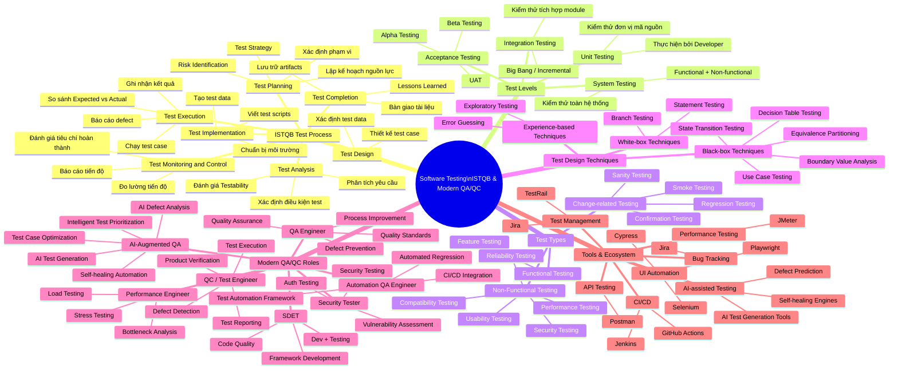

# 🧠 Mindmap – Software Testing: ISTQB & Modern QA/QC

> **Chủ đề trung tâm:** Software Testing – ISTQB & Modern QA/QC  
> **Mục đích:** Tổng quan quy trình kiểm thử theo ISTQB và các vai trò QA/QC hiện đại  
> **Phiên bản tham chiếu:** ISTQB CTFL v4.0  
> **Ngày tạo:** 27/09/2026

---

## Cấu trúc Mindmap (Markdown Outline)

```
Software Testing – ISTQB & Modern QA/QC
│
├── 1. Quy Trình Kiểm Thử (ISTQB Test Process)
│   ├── 1.1 Test Planning
│   │   ├── Xác định phạm vi kiểm thử
│   │   ├── Lập kế hoạch nguồn lực
│   │   ├── Xác định rủi ro (Risk Identification)
│   │   └── Xây dựng Test Strategy
│   │
│   ├── 1.2 Test Monitoring and Control
│   │   ├── Đánh giá tiêu chí hoàn thành
│   │   ├── Đo lường tiến độ
│   │   └── Báo cáo tiến độ
│   │
│   ├── 1.3 Test Analysis
│   │   ├── Phân tích yêu cầu (Requirements)
│   │   ├── Xác định điều kiện kiểm thử
│   │   └── Đánh giá testability
│   │
│   ├── 1.4 Test Design
│   │   ├── Thiết kế test case
│   │   └── Xác định test data cần thiết
│   │
│   ├── 1.5 Test Implementation
│   │   ├── Tạo test data
│   │   ├── Chuẩn bị test environment
│   │   └── Viết test scripts
│   │
│   ├── 1.6 Test Execution
│   │   ├── Chạy test case
│   │   ├── Ghi nhận kết quả thực tế
│   │   ├── So sánh Expected vs Actual Result
│   │   └── Báo cáo defect
│   │
│   └── 1.7 Test Completion
│       ├── Lưu trữ test artifacts
│       ├── Bàn giao tài liệu
│       └── Lessons Learned
│
├── 2. Các Cấp Độ Kiểm Thử (Test Levels)
│   ├── 2.1 Unit Testing
│   │   ├── Kiểm thử từng đơn vị mã nguồn
│   │   ├── Thực hiện bởi Developer
│   │   └── Công cụ: JUnit, PyTest, NUnit
│   │
│   ├── 2.2 Integration Testing
│   │   ├── Kiểm thử tích hợp giữa các module
│   │   ├── Big Bang / Incremental / Sandwich
│   │   └── Công cụ: Postman, REST Assured
│   │
│   ├── 2.3 System Testing
│   │   ├── Kiểm thử toàn bộ hệ thống
│   │   ├── Thực hiện bởi QA Team
│   │   └── Bao gồm: Functional + Non-functional
│   │
│   └── 2.4 Acceptance Testing
│       ├── User Acceptance Testing (UAT)
│       ├── Alpha Testing
│       └── Beta Testing
│
├── 3. Các Loại Kiểm Thử (Test Types)
│   │
│   ├── 3.1 Functional Testing (Kiểm thử chức năng)
│   │   └── Feature Testing
│   │
│   ├── 3.2 Non-Functional Testing (Kiểm thử phi chức năng)
│   │   ├── Performance Testing
│   │   ├── Security Testing
│   │   ├── Usability Testing
│   │   ├── Compatibility Testing
│   │   └── Reliability Testing
│   │
│   └── 3.3 Change-related Testing (Kiểm thử liên quan thay đổi)
│       ├── Confirmation Testing
│       ├── Regression Testing
│       ├── Smoke Testing
│       └── Sanity Testing
│
├── 4. Kỹ Thuật Thiết Kế Kiểm Thử (Test Design Techniques)
│   │
│   ├── 4.1 Black-box Techniques
│   │   ├── Equivalence Partitioning
│   │   ├── Boundary Value Analysis
│   │   ├── Decision Table Testing
│   │   ├── State Transition Testing
│   │   └── Use Case Testing
│   │
│   ├── 4.2 White-box Techniques
│   │   ├── Statement Testing
│   │   └── Branch Testing
│   │
│   └── 4.3 Experience-based Techniques
│       ├── Error Guessing
│       └── Exploratory Testing
│
├── 5. Vai Trò QA/QC Hiện Đại (Modern QA/QC Roles)
│   │
│   ├── 5.1 QA Engineer
│   │   ├── Quality Assurance (Đảm bảo chất lượng)
│   │   ├── Process Improvement
│   │   ├── Quality Standards & Compliance
│   │   └── Defect Prevention
│   │
│   ├── 5.2 QC / Test Engineer
│   │   ├── Product Verification
│   │   ├── Test Execution
│   │   ├── Defect Detection & Reporting
│   │   └── Test Reporting
│   │
│   ├── 5.3 Automation QA Engineer
│   │   ├── Test Automation Framework Design
│   │   ├── Script Development
│   │   ├── CI/CD Integration
│   │   └── Automated Regression Testing
│   │
│   ├── 5.4 SDET (Software Development Engineer in Test)
│   │   ├── Software Development + Testing
│   │   ├── Test Framework Development
│   │   ├── Automation Infrastructure
│   │   └── Code Quality & Code Review
│   │
│   ├── 5.5 Performance Engineer
│   │   ├── Load Testing
│   │   ├── Stress Testing
│   │   ├── Performance Monitoring
│   │   └── Bottleneck Analysis
│   │
│   ├── 5.6 Security Tester
│   │   ├── Security Testing
│   │   ├── Vulnerability Assessment
│   │   └── Authentication / Authorization Testing
│   │
│   └── 5.7 AI-Augmented QA *(Vai trò mới nổi 2024–2026)*
│       ├── AI-assisted Test Generation
│       ├── Test Case Optimization (ML-based)
│       ├── AI-assisted Defect Analysis
│       ├── Self-healing Automation
│       └── Intelligent Test Prioritization
│
└── 6. Công Cụ Hỗ Trợ QA/QC (Tools & Ecosystem)
    │
    ├── 6.1 Test Management
    │   ├── Jira (Issue & Project Tracking)
    │   └── TestRail (Test Case Management)
    │
    ├── 6.2 Bug Tracking
    │   └── Jira (Defect Lifecycle Management)
    │
    ├── 6.3 API Testing
    │   └── Postman
    │
    ├── 6.4 UI Automation
    │   ├── Selenium WebDriver
    │   ├── Playwright
    │   └── Cypress
    │
    ├── 6.5 Performance Testing
    │   └── Apache JMeter
    │
    ├── 6.6 CI/CD Integration
    │   ├── Jenkins
    │   └── GitHub Actions
    │
    └── 6.7 AI-assisted Testing Tools
        ├── AI test case generation
        ├── AI defect prediction & analysis
        └── Self-healing automation engines
```

---

## Sơ đồ Mermaid (Mindmap Syntax)

> Có thể dán trực tiếp vào [Mermaid Live Editor](https://mermaid.live) để render.



---

## Giải thích Cấu trúc Mindmap

| Nhánh chính | Nội dung | Số nhánh con |
|---|---|:---:|
| **1. ISTQB Test Process** | 7 hoạt động theo trình tự chuẩn ISTQB CTFL v4.0 | 7 |
| **2. Test Levels** | 4 cấp độ kiểm thử từ Unit đến Acceptance | 4 |
| **3. Test Types** | Functional, Non-functional và Change-related Testing | 10 |
| **4. Test Design Techniques** | Black-box, White-box và Experience-based | 9 |
| **5. Modern QA/QC Roles** | 7 vai trò hiện đại, bao gồm AI-Augmented QA | 7 |
| **6. Tools & Ecosystem** | 7 nhóm công cụ theo chức năng | 7 |

---

## Lưu ý Học Thuật

> **Nguồn tham chiếu:**
> - ISTQB CTFL Syllabus v4.0 (2023) – International Software Testing Qualifications Board
> - Các vai trò QA/QC hiện đại được xác định dựa trên xu hướng ngành năm 2024–2026
> - Vai trò **AI-Augmented QA** là vai trò mới nổi, được bổ sung theo thực tiễn ngành

> **Lưu ý về tính chính xác:**
> - Không bổ sung khái niệm ngoài phạm vi ISTQB khi mô tả quy trình kiểm thử
> - Các vai trò QA/QC được mô tả theo thực tế thị trường lao động 2024–2026
> - Mermaid syntax được kiểm tra để tương thích với Mermaid v10+

---

*Mindmap được tạo ngày 27/09/2026 | Môn: Software Testing | MSSV: 23120256*
